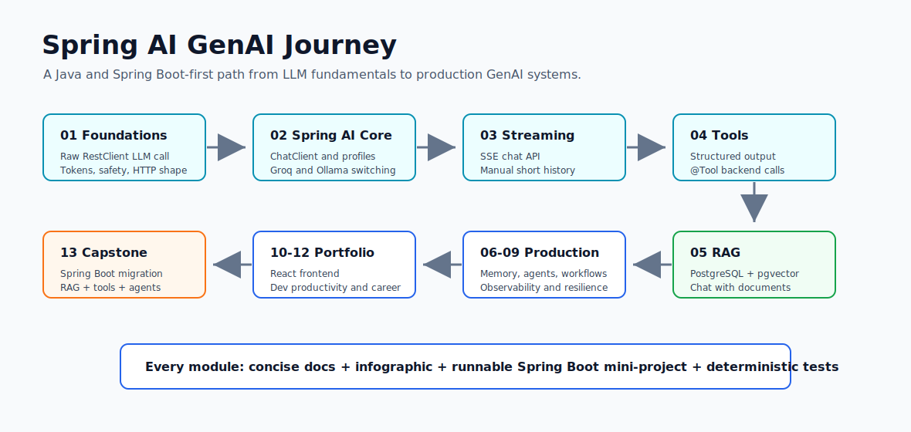

# Spring AI GenAI Journey

A Java/Spring Boot-first GenAI course with runnable projects for ChatClient, streaming, tool calling, RAG with pgvector, agents, and production AI patterns. No Python required.



[](https://www.oracle.com/java/)
[](https://spring.io/projects/spring-boot)
[](https://spring.io/projects/spring-ai)
[](https://maven.apache.org/)
[](#module-progress)

## The Promise

This is a practical Spring AI course for Java developers who want to build production GenAI apps without switching to Python.

You get concise learning docs, infographics, and runnable Spring Boot mini-projects. Each project is designed around a real backend pattern: provider switching, streaming, structured output, tool calling, RAG, memory, agents, workflows, observability, and a capstone.

## Who This Is For

- Java and Spring Boot engineers moving into GenAI.
- Backend developers who want runnable examples instead of notebook-only demos.
- Architects evaluating Spring AI for enterprise apps.
- Developers who want Groq, Ollama, PostgreSQL, pgvector, and Spring Boot in one learning path.

## Why Java and Spring AI

Spring AI lets Java teams reuse familiar production patterns:

- configuration through `application.yml` and profiles
- typed controllers, services, and records
- validation with Jakarta Validation
- observability through Spring Boot Actuator and Micrometer
- clear service boundaries for tools, RAG, and workflows
- provider-neutral model access through Spring AI abstractions

The point is not to copy Python workflows into Java. The point is to build GenAI systems the Spring way.

## What Makes This Repo Different

- No Python required for the core course.
- Every completed module has runnable Spring Boot code.
- Mini-projects include `mvn test`, run commands, curl examples, and response shapes.
- Infographics are included directly in module docs.
- Provider credentials stay in environment variables.
- Default tests do not call live paid or flaky LLM APIs.
- Production habits appear early: validation, safety flags, tool traces, and provider profiles.

## Quickstart

Prerequisites:

- Java 21
- Maven
- Docker Desktop for later pgvector modules
- Ollama for local model tests
- Optional Groq API key for hosted model tests

Run the latest completed module:

```powershell
cd F:\GEN_AI_COURSE\module_04_structured_output_tools\mini_project
mvn test

$env:GROQ_API_KEY="your_key_here"
mvn spring-boot:run -Dspring-boot.run.profiles=groq
```

Try the Module 4 assistant:

```powershell
curl.exe -X POST http://localhost:8082/api/assistant `
  -H "Content-Type: application/json" `
  -d "{\"customerId\":\"cust-100\",\"message\":\"What is the status of order ORD-1001?\",\"confirmed\":false}"
```

Expected shape:

```json
{
  "intent": "ORDER_STATUS",
  "answer": "Order ORD-1001 has shipped and is on the way.",
  "actionRequired": false,
  "toolsCalled": [],
  "safetyNotes": [],
  "confidence": 0.9
}
```

## Module Progress

| Module | Topic | Project | Status |
|---|---|---|---|
| 01 | Raw LLM HTTP call | First LLM API | Done |
| 02 | Spring AI Core | Multi-provider chat | Done |
| 03 | Streaming Chat | SSE chat API | Done |
| 04 | Tool Calling | Order assistant | Done |
| 05 | RAG + pgvector | Chat with docs | Next |
| 06 | Advisors and Memory | Cross-cutting AI concerns | Planned |
| 07 | MCP and Agents | Agent tools and MCP | Planned |
| 08 | Workflows and Streaming | Stateful AI workflows | Planned |
| 09 | Observability and Resilience | Production AI patterns | Planned |
| 10 | React Frontend | AI API UI | Planned |
| 11 | AI-Assisted Development | Java productivity workflows | Planned |
| 12 | Career and Portfolio | Resume and interview prep | Planned |
| 13 | Capstone | Spring Boot migration assistant | Planned |

## Featured Mini-Projects

| Project | What it demonstrates | Run |
|---|---|---|
| [Module 1 mini-project](module_01_foundations/mini_project/README.md) | Raw HTTP call to an LLM with Spring `RestClient` | `mvn test` |
| [Module 2 mini-project](module_02_spring_ai_core/mini_project/README.md) | Spring AI `ChatClient`, Groq/Ollama provider switching | `mvn test` |
| [Module 3 mini-project](module_03_chatclient_deep_dive/mini_project/README.md) | Streaming and non-streaming chat API with SSE | `mvn test` |
| [Module 4 mini-project](module_04_structured_output_tools/mini_project/README.md) | Structured output, `@Tool`, tool traces, cancellation safety | `mvn test` |

## Screenshots and Infographics

| Area | Visual |
|---|---|
| Repository path | [docs/assets/repo-architecture.svg](docs/assets/repo-architecture.svg) |
| Social preview source | [docs/assets/social-preview.svg](docs/assets/social-preview.svg) |
| Module 1 learning flow | [module_01_foundations/assets/module-learning-flow.svg](module_01_foundations/assets/module-learning-flow.svg) |
| Module 2 learning flow | [module_02_spring_ai_core/assets/module-learning-flow.svg](module_02_spring_ai_core/assets/module-learning-flow.svg) |
| Module 3 learning flow | [module_03_chatclient_deep_dive/assets/module-learning-flow.svg](module_03_chatclient_deep_dive/assets/module-learning-flow.svg) |
| Module 4 learning flow | [module_04_structured_output_tools/assets/module-learning-flow.svg](module_04_structured_output_tools/assets/module-learning-flow.svg) |

## Demo Commands

Module 2, multi-provider chat:

```powershell
cd F:\GEN_AI_COURSE\module_02_spring_ai_core\mini_project
mvn test
mvn spring-boot:run -Dspring-boot.run.profiles=ollama
```

Module 3, streaming chat:

```powershell
cd F:\GEN_AI_COURSE\module_03_chatclient_deep_dive\mini_project
mvn test
mvn spring-boot:run -Dspring-boot.run.profiles=ollama
```

Module 4, tool-calling assistant:

```powershell
cd F:\GEN_AI_COURSE\module_04_structured_output_tools\mini_project
mvn test
$env:GROQ_API_KEY="your_key_here"
mvn spring-boot:run -Dspring-boot.run.profiles=groq
```

## Learning Path

1. Read [00_MASTER_ROADMAP.md](00_MASTER_ROADMAP.md).
2. Skim [01_GLOSSARY.md](01_GLOSSARY.md).
3. Complete [02_ENVIRONMENT_SETUP.md](02_ENVIRONMENT_SETUP.md).
4. Work through modules in order.
5. Run each mini-project and keep notes for interview stories.

## Repository Layout

```text
.
|-- 00_MASTER_ROADMAP.md
|-- 01_GLOSSARY.md
|-- 02_ENVIRONMENT_SETUP.md
|-- module_01_foundations/
|-- module_02_spring_ai_core/
|-- module_03_chatclient_deep_dive/
|-- module_04_structured_output_tools/
|-- module_05_rag_with_pgvector/
|-- module_06_advisors_and_memory/
|-- module_07_mcp_and_agents/
|-- module_08_workflows_streaming/
|-- module_09_observability_resilience/
|-- module_10_react_frontend/
|-- module_11_dev_productivity/
|-- module_12_career_portfolio/
`-- module_13_capstone/
```

Each runnable mini-project follows a normal Maven Spring Boot shape:

```text
mini_project/
|-- pom.xml
|-- src/main/java/
|-- src/main/resources/
`-- src/test/java/
```

## GitHub Topics

Add these topics in GitHub repository settings:

```text
spring-ai
spring-boot
java
generative-ai
llm
rag
pgvector
ollama
groq
tool-calling
ai-agents
chatclient
```

## Release Milestone

Suggested first public release:

```text
v0.1.0 - Spring AI foundations, streaming, and tool calling
```

Included:

- Module 1: raw LLM HTTP call
- Module 2: Spring AI ChatClient and provider switching
- Module 3: SSE streaming chat API
- Module 4: structured output and backend tool calling

Release notes draft: [docs/releases/v0.1.0.md](docs/releases/v0.1.0.md)

## Social Preview

Use [docs/assets/social-preview.png](docs/assets/social-preview.png) as the GitHub social preview image. The editable source is [docs/assets/social-preview.svg](docs/assets/social-preview.svg).

## Contributing

See [CONTRIBUTING.md](CONTRIBUTING.md) for module structure, test expectations, and documentation style.

## Launch Checklist

See [docs/GITHUB_LAUNCH_CHECKLIST.md](docs/GITHUB_LAUNCH_CHECKLIST.md) for the practical steps to make this repository easier to discover, star, and fork.

## License

No license file is included by request.
