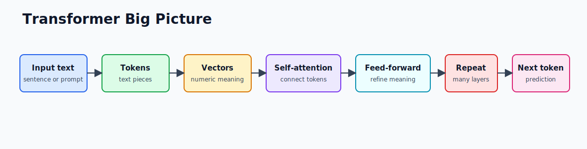
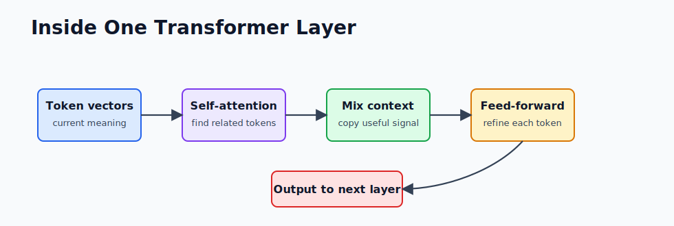

# 1.2 - Transformers Intuition

> Module 1 - File 2 of 6 - Simple mental model, no math

## What Problem Transformers Solved

Before transformers, many language models read text mostly from left to right, one token at a time. That made long text hard. If the important clue was 200 words earlier, the model could lose track.

A transformer looks at all tokens in a chunk together and asks: "Which other words should this word pay attention to?"

Simple example:

> The customer dropped the laptop because **it** was overheating.

The word `it` should pay attention to `laptop`, not `customer`. Self-attention is the mechanism that helps the model learn that connection.

## Big Picture Diagram



## The Flow in Plain English

1. Text becomes tokens.
2. Each token becomes a vector, which is a list of numbers.
3. Each token compares itself with the other tokens.
4. The model gives higher attention to useful tokens.
5. Many layers repeat this process.
6. The final output is a probability list for the next token.

## What Happens Inside One Transformer Layer

You do not need the math yet, but you should know the moving parts:



Think of each layer as a refinement pass. Early layers learn simple relationships such as word shape and grammar. Middle layers learn syntax and local meaning. Later layers combine higher-level meaning, task instruction, and answer style.

### Query, Key, and Value in Simple Terms

Attention often uses three names: query, key, and value.

| Term | Simple Meaning |
|---|---|
| Query | What this token is looking for |
| Key | What each other token offers |
| Value | The information copied from useful tokens |

Analogy: when reading "it was overheating", the token `it` sends a query like "what object am I referring to?" The token `laptop` has a useful key, so its value influences the meaning of `it`.

## Self-Attention in One Sentence

Self-attention lets every word ask, "Which other words in this context help explain me?"


## Why This Matters for Engineers

Transformers are not magic search engines. They are pattern learners that predict the next token using context. When they answer well, it is because the prompt and context gave them enough signal. When they answer badly, common causes are missing context, confusing instructions, or facts outside the model's knowledge.

For Spring developers, this matters because your job is often not to train the transformer. Your job is to send the right context, call the right tools, validate the output, and observe the system in production.

## Transformer vs Older Sequence Models

| Older RNN-style idea | Transformer idea |
|---|---|
| Read tokens mostly one after another | Look across many tokens at once |
| Long-distance relationships are hard | Attention directly connects distant tokens |
| Training is slower to parallelize | Training scales better on GPUs |
| Harder to use huge datasets efficiently | Better fit for internet-scale pre-training |

This scaling behavior is why transformers became the foundation for modern LLMs.

## Key Terms

| Term | Simple Meaning |
|---|---|
| Token | A piece of text, often a word or part of a word |
| Vector | Numeric representation of meaning |
| Attention | A score showing which tokens matter to each other |
| Layer | One processing step inside the model |
| Context window | The amount of text the model can consider at once |
| Parameter | A learned number inside the model |
| Logit | A raw score before probabilities are calculated |

## Java Analogy

Think of a transformer like a large pipeline:

```text
String input
  -> tokenizer
  -> vector lookup
  -> attention layers
  -> prediction head
  -> String output
```

You do not call these internals directly from Spring Boot. You call an API. But understanding the flow helps you design prompts, handle context limits, and debug bad responses.

## Common Misunderstandings

- "The model searches the internet." Usually false. A normal LLM call only uses its trained weights plus the prompt you send.
- "The model remembers my previous API call." Usually false. You must send conversation history or use a memory feature.
- "More context is always better." False. Irrelevant context can distract the model and increase cost.
- "The model reasons exactly like a human." False. It predicts tokens using learned patterns, although some outputs look like reasoning.

## Mini Exercise

Read this sentence:

```text
The service returned 429 because it exceeded the provider rate limit.
```

Ask yourself:

1. What does `it` refer to?
2. Which words help you decide?
3. If you removed "provider rate limit", would the meaning be weaker?

That is the kind of relationship self-attention helps the model capture.

## Remember This

A transformer predicts the next token, but it does so after building a rich internal map of how all tokens in the context relate to one another.
