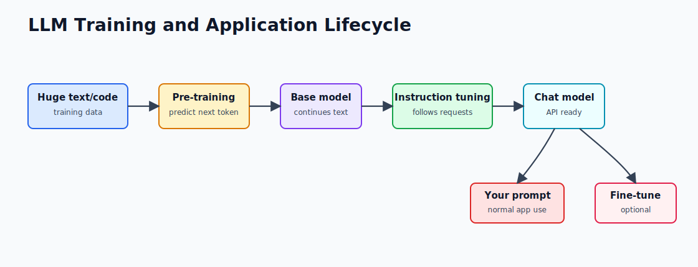

# 1.3 - LLMs: Pre-Trained vs Fine-Tuned

> Module 1 - File 3 of 6 - What training means in practical terms

## The Simple Idea

Most application developers do not train LLMs from scratch. That is too expensive and needs huge datasets, GPU clusters, and ML research expertise.

Instead, you usually use a pre-trained model through an API, then guide it with prompts, tools, RAG, or sometimes fine-tuning.

## Model Lifecycle Diagram



## Pre-Training

Pre-training is where the model learns general language and code patterns. The common training task is simple:

> Given previous tokens, predict the next token.

This sounds basic, but at internet scale the model learns grammar, facts, reasoning patterns, code structure, style, and many domain patterns.

You normally do not do this yourself.

### Why Pre-Training Works So Well

The next-token task creates a huge training signal. Every sentence on the internet becomes many training examples:

```text
Spring Boot makes it easy to create standalone applications

Input:  Spring
Label:  Boot

Input:  Spring Boot makes it easy
Label:  to
```

At large scale, this teaches grammar, facts, code idioms, APIs, reasoning patterns, and common writing styles.

## Instruction Tuning

A base model predicts text, but it may not behave like an assistant. Instruction tuning teaches the model to follow commands:

```text
User asks a question -> assistant gives a useful answer
User asks for code -> assistant returns code
User asks unsafe request -> assistant refuses or redirects
```

Most models you use in apps are already instruction-tuned chat models.

### Why Chat Models Feel Different

A base model may simply continue text. A chat model has been trained to respond to roles:

| Role | Purpose |
|---|---|
| System | Sets behavior and boundaries |
| User | Contains the user task |
| Assistant | Contains model responses |
| Tool | Contains external tool results in tool-calling systems |

This is why the Module 1 mini-project sends both a system message and a user message.

## Fine-Tuning

Fine-tuning means training an existing model a little more on your examples. It can help when you need a consistent style, fixed output pattern, or domain language.

Fine-tuning is usually not the first tool you should reach for.

### Fine-Tuning Does Not Teach Live Facts Well

If your app needs yesterday's invoices, current product prices, or private company policy, fine-tuning is the wrong first answer. Those facts change. Put them in a database, retrieve them, and send them as context.

## Decision Flow


## When Fine-Tuning Is Worth It

Use fine-tuning when:

- You have many high-quality examples.
- The task repeats often.
- Prompting is too long, expensive, or inconsistent.
- The answer style must be very specific.

Avoid fine-tuning when:

- The model lacks fresh facts.
- The model needs private documents.
- The model must call internal systems.
- You only have a few examples.

For those cases, use RAG, tools, and better prompts.

## Prompting vs RAG vs Tools vs Fine-Tuning

| Technique | Best For | Example |
|---|---|---|
| Prompting | Clear instructions and style | "Answer in 3 bullets with code examples" |
| Structured output | Reliable JSON or typed responses | Return `{"riskScore": 7}` |
| RAG | Private or large knowledge sources | Answer from internal docs |
| Tool calling | Taking action or fetching live data | Check order status from database |
| Fine-tuning | Repeated style or narrow pattern | Rewrite support replies in company tone |

Use the cheapest reliable technique first. In many business apps, prompt + RAG + tools beats fine-tuning.

## Spring Engineer View

In a Spring Boot app, you will usually do this:

```text
Controller
  -> service builds prompt
  -> service adds retrieved context or tool results
  -> LLM API returns answer
  -> app validates and logs result
```

Fine-tuning is not required for Module 1. Your first project uses a normal chat model through Groq. Later modules add Spring AI, RAG, advisors, tools, memory, and observability.

## Practical Example

Suppose you build a support assistant for an e-commerce app.

| Requirement | Best Approach |
|---|---|
| Answer "How do I reset my password?" | Prompt + public help docs |
| Answer "Where is order 123?" | Tool call to order service |
| Answer from 500 internal SOP pages | RAG |
| Always respond in company support tone | Prompt first, fine-tune only if needed |
| Decide refund eligibility | App rules first, model explains result |

The important pattern: the model should not become your database, policy engine, or authorization layer.

## Mini Exercise

For each requirement, choose prompting, RAG, tool calling, or fine-tuning:

1. "Summarize this support ticket in one paragraph."
2. "Tell the customer the live delivery ETA."
3. "Answer questions from our private HR policy PDF."
4. "Generate product descriptions in our exact brand voice, thousands per day."

Expected direction: 1 prompt, 2 tool, 3 RAG, 4 maybe fine-tuning after prompt evaluation.

## Remember This

Pre-training gives the model broad ability. Fine-tuning changes behavior for a repeated pattern. RAG and tools give the model current, private, or system-specific information.
