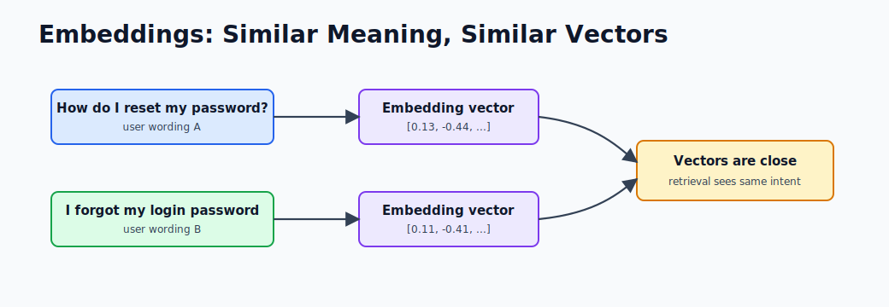
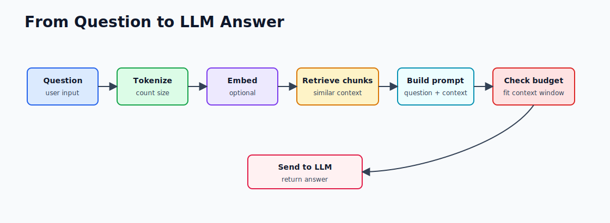
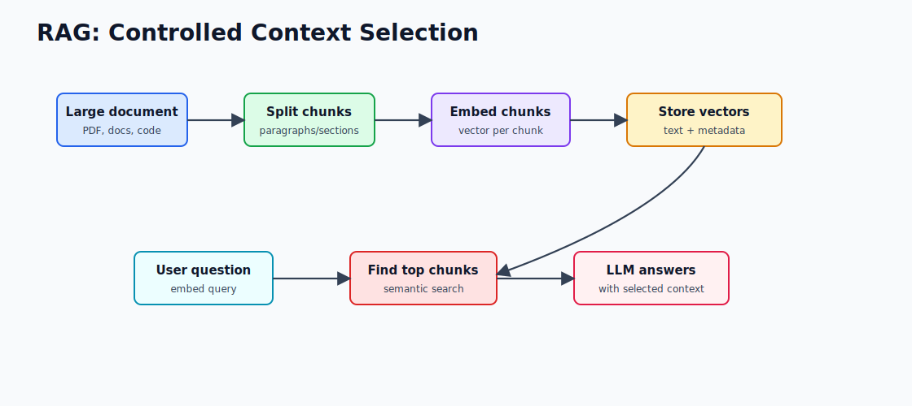

# 1.4 - Tokens, Embeddings, and Context Windows

> Module 1 - File 4 of 6 - Three concepts you will use every day

## Why These Concepts Matter

When an LLM app fails, the reason is often one of these:

- The prompt used too many tokens.
- The model did not have the right context.
- Retrieval found the wrong documents.
- The model had to answer from weak or missing information.

Tokens, embeddings, and context windows explain most of this behavior.

## Tokens

A token is a piece of text. It can be a word, part of a word, punctuation, or whitespace.

```text
"Spring Boot is great"
  -> ["Spring", " Boot", " is", " great"]
```

Exact tokenization depends on the model. You pay for tokens, and the model can only process a limited number at once.

### Rough Token Estimation

A practical English estimate:

```text
1 token ~= 3 to 4 English characters
100 tokens ~= 75 English words
1,000 tokens ~= 750 English words
```

This is only an estimate. Code, JSON, long identifiers, and non-English text can tokenize differently.

For Java prompts, long package names and stack traces can consume many tokens quickly:

```text
com.example.customer.onboarding.workflow.CustomerOnboardingCoordinator
```

That may be one readable Java identifier for you, but many tokens for the model.

## Embeddings

An embedding is a vector that represents meaning. Similar text has similar vectors.



This is the core idea behind RAG. You turn documents into embeddings, store them in a vector database, then retrieve the most similar chunks for a user question.

### What Embeddings Are Good At

Embeddings are useful when exact keyword search is too brittle.

| User says | Relevant doc might say |
|---|---|
| forgot password | reset login credentials |
| cancel order | stop shipment before dispatch |
| database is slow | query latency increased |

Keyword search may miss these. Vector search can often connect them because the meanings are close.

### What Embeddings Are Bad At

Embeddings are not perfect for:

- Exact IDs such as invoice numbers.
- Strict dates or amounts.
- Permissions and authorization.
- Complex boolean filters.

Use normal database filters for exact structured fields, then vector search for semantic text.

## Context Window

The context window is the maximum amount of text the model can consider in one request. It includes:

- System message
- User message
- Conversation history
- Retrieved documents
- Tool results
- The model's generated answer

## Request Flow



## Practical Example

If your model has an 8,000 token context window, you cannot send a 200-page PDF directly. You need to chunk it, retrieve relevant sections, and send only the useful parts.

That is why RAG is not "upload everything to the prompt." RAG is controlled context selection.

## Chunking Flow for RAG



Good chunks are large enough to contain meaning but small enough to retrieve precisely. A paragraph or section often works better than a full document.

## Token Budget Checklist

Before calling a model, ask:

1. How long is the user question?
2. How much chat history am I including?
3. How many retrieved chunks am I adding?
4. How much room do I need for the answer?
5. What happens if the request is too large?

## Spring Engineer View

In production, token usage becomes a cost and reliability concern. You should log:

```text
prompt_tokens
completion_tokens
total_tokens
latency_ms
model
```

The Module 1 mini-project already returns prompt tokens, completion tokens, latency, and model name. That is the start of production-grade observability.

## Common Production Bugs

| Bug | Symptom | Fix |
|---|---|---|
| Too much history | Requests get slow or fail | Summarize or trim history |
| Bad chunking | Answers cite irrelevant docs | Improve split strategy and metadata |
| No token logging | Cost surprises | Log prompt and completion tokens |
| Sending secrets | Security incident risk | Redact before prompt construction |
| No output budget | Model response cuts off | Reserve completion tokens |

## Mini Exercise

Imagine your user asks:

```text
Explain why my Spring Boot app fails with a circular dependency error.
```

You have these possible context items:

1. The full 20,000-line application log.
2. The 30 lines around the circular dependency stack trace.
3. The two service classes mentioned in the error.
4. The company holiday policy.

Best context: 2 and 3. More context is not automatically better.

## Remember This

Tokens control size and cost. Embeddings help find meaning. The context window is the model's working memory for one request.
