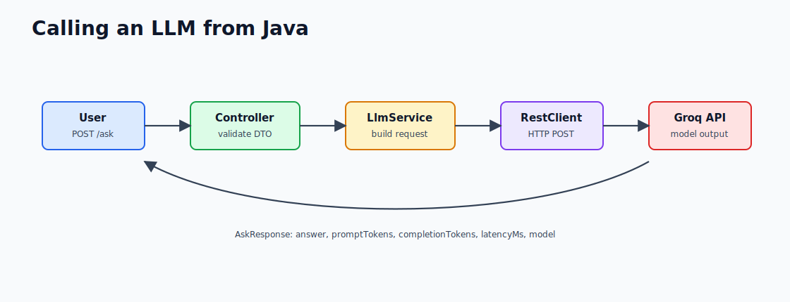

# 1.6 - Calling an LLM from Java

> Module 1 - File 6 of 6 - Raw HTTP before Spring AI

## Why Start Without Spring AI

Spring AI will make LLM integration easier later. First, you should understand the raw HTTP shape. Once you know the request, response, errors, and metrics, Spring AI will feel like a helpful abstraction instead of magic.

In Module 1, the mini-project calls Groq using Spring Boot `RestClient`.

## API Flow



## Request Shape

Groq supports an OpenAI-compatible chat completions API. That means the body looks like this:

```json
{
  "model": "llama-3.3-70b-versatile",
  "temperature": 0.3,
  "max_tokens": 800,
  "messages": [
    {
      "role": "system",
      "content": "You are a helpful technical assistant."
    },
    {
      "role": "user",
      "content": "Explain Spring Boot in 3 sentences."
    }
  ]
}
```

The HTTP headers usually include:

```http
Authorization: Bearer <GROQ_API_KEY>
Content-Type: application/json
```

Never hard-code the API key in Java code. Read it from an environment variable and fail clearly when it is missing.

## Response Shape

The response usually contains:

```json
{
  "choices": [
    {
      "message": {
        "role": "assistant",
        "content": "Spring Boot is..."
      }
    }
  ],
  "usage": {
    "prompt_tokens": 65,
    "completion_tokens": 84,
    "total_tokens": 149
  }
}
```

Your service should return the useful parts:

```json
{
  "answer": "Spring Boot is...",
  "promptTokens": 65,
  "completionTokens": 84,
  "latencyMs": 1247,
  "model": "llama-3.3-70b-versatile"
}
```

## Controller vs Service Responsibility

Keep the responsibilities clean:

| Layer | Responsibility |
|---|---|
| Controller | HTTP route, request validation, response object |
| Service | Build LLM request, call provider, parse response |
| Config | Base URL, API key, timeout, model |
| Exception handler | Convert failures into clear HTTP errors |

This keeps the LLM provider detail out of the controller and makes the service testable.

## Java Flow


## `RestClient` Call Shape

The important part of the service looks like this:

```java
Map<String, Object> response = restClient.post()
        .uri("/chat/completions")
        .body(requestBody)
        .retrieve()
        .body(Map.class);
```

Line by line:

1. `post()` starts an HTTP POST.
2. `uri("/chat/completions")` appends the endpoint to the configured base URL.
3. `body(requestBody)` serializes the Java `Map` to JSON.
4. `retrieve()` sends the request and prepares response handling.
5. `body(Map.class)` deserializes JSON back into a Java `Map`.

This is intentionally raw. Later, Spring AI wraps much of this behind higher-level model APIs.

## Errors You Must Handle

| Error | Common Cause | Good Response |
|---|---|---|
| Missing API key | `GROQ_API_KEY` not set | Clear setup message |
| 401 | Wrong API key | Say key is invalid |
| 429 | Rate limit | Ask user to retry later |
| Timeout | Network or provider slow | Return bad gateway style error |
| 5xx | Provider issue | Return provider unavailable |
| Bad JSON | Unexpected provider response | Log and fail safely |

## Local Ollama vs Groq

You installed Ollama locally, but the Module 1 mini-project uses Groq because the exercise teaches a real remote HTTP API using an API key.

| Provider | Why Use It Here |
|---|---|
| Groq | Fast hosted API, OpenAI-compatible shape, good for learning remote calls |
| Ollama | Local model, no provider cost, useful later for offline/local experiments |

The request concepts are similar: model name, prompt/messages, response parsing, latency, and errors. The exact endpoint and response JSON may differ.

## Why `RestClient`

`RestClient` is Spring's modern synchronous HTTP client. It is a good fit for Module 1 because the first version is a normal request-response API.

Later, streaming responses need a different approach, often with reactive clients or SSE support.

## Manual Test with Curl

When the app is running:

```bash
curl -X POST http://localhost:8080/ask \
  -H "Content-Type: application/json" \
  -d '{"question":"Explain RestClient in Spring Boot in 3 bullets"}'
```

Good signs:

- HTTP 200.
- `answer` is non-empty.
- `promptTokens` is greater than zero.
- `completionTokens` is greater than zero.
- `latencyMs` is recorded.

## Configuration Pattern

Keep provider settings outside Java code:

```yaml
groq:
  base-url: https://api.groq.com/openai/v1
  api-key: ${GROQ_API_KEY:}
  model: llama-3.3-70b-versatile
  timeout-seconds: 30
```

This lets you change model or provider configuration without editing service logic.

## Troubleshooting

| Symptom | Likely Cause | Check |
|---|---|---|
| 500 with missing key message | `GROQ_API_KEY` not visible to process | Open a new terminal and check env var |
| 401 from provider | Wrong or revoked key | Create a new Groq key |
| 429 from provider | Rate limit | Wait or use a smaller/faster model |
| Timeout | Network/provider slow | Increase timeout or retry later |
| Empty answer | Unexpected response parsing | Log raw provider response in dev only |

## Test Strategy

Do not call Groq in normal unit tests. Use `MockRestServiceServer` to return a fake provider response:

```text
Given question "hello"
When Groq returns choices[0].message.content = "hi"
Then service returns AskResponse.answer = "hi"
```

This proves your parsing and error handling work without spending tokens or depending on network access.

## Remember This

An LLM call is just an HTTP call with a special request body and a probabilistic response. Production quality comes from validation, error handling, token tracking, latency tracking, and safe configuration.
