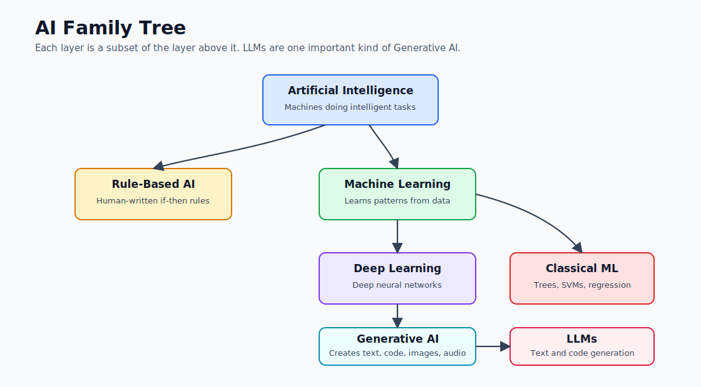
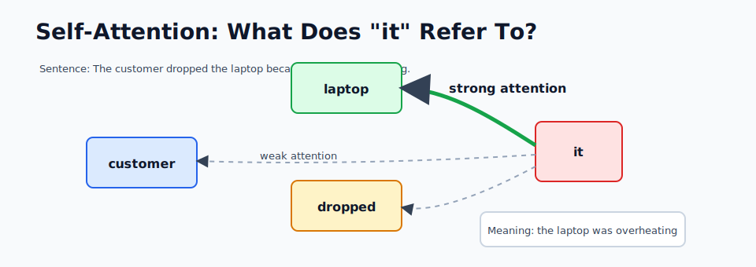
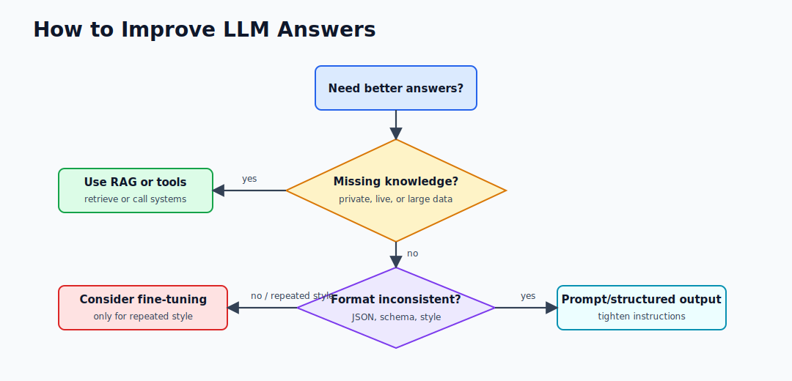
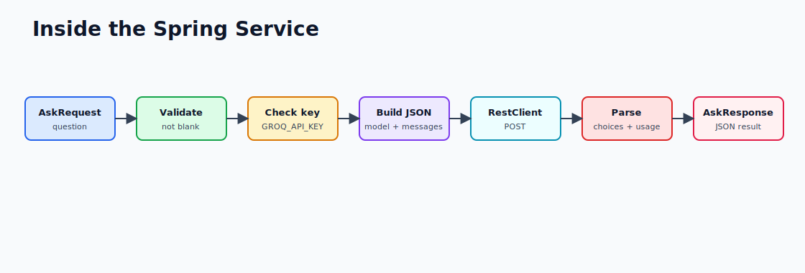

# Module 1 Interview Prep

Use these answers after reading files 01 through 06. Keep your spoken answers short, then expand only if asked.

## 1. AI vs ML vs Deep Learning vs GenAI

AI is the broad goal: make machines perform tasks that seem intelligent. Machine Learning is a subset where systems learn patterns from data. Deep Learning is a subset of ML using multi-layer neural networks. Generative AI is a subset of deep learning that creates new content such as text, code, images, or audio.



Strong interview phrasing:

> "Traditional ML often predicts a label or score for a specific task. Generative AI produces new content and can perform many tasks through prompting because large transformer models are pre-trained on broad corpora."

## 2. What Is a Transformer?

A transformer is a neural network architecture that uses self-attention to understand relationships between tokens in a context. It replaced older sequence-heavy approaches because it trains efficiently and handles long-range dependencies better.

Follow-up detail:

> "The important engineering implication is that transformers are context-driven. If the right information is not in the prompt or accessible through tools/RAG, the model may guess."

## 3. What Is Self-Attention?

Self-attention lets each token decide which other tokens are important. In "the laptop overheated, so it shut down," the word `it` should attend strongly to `laptop`.



## 4. What Is a Token?

A token is a chunk of text used by the model. It can be a word, part of a word, punctuation, or whitespace. Tokens matter because they control cost, request size, and context limits.

Example:

```text
Request cost = input tokens + output tokens
Latency often rises as token count rises
Context limit is measured in tokens, not pages
```

## 5. Pre-Training vs Fine-Tuning

Pre-training teaches a model broad language and code patterns using huge datasets. Fine-tuning adjusts an existing model for a narrower repeated behavior. If the model needs private or fresh facts, use RAG or tools before considering fine-tuning.



## 6. What Is the Context Window?

The context window is the maximum text the model can consider in one request. It includes the system prompt, user prompt, history, retrieved context, tool results, and generated answer. If important information is outside the context window, the model cannot use it.

Production answer:

> "I treat the context window as a scarce resource. I trim chat history, retrieve only relevant chunks, and reserve enough tokens for the answer."

## 7. Java-Specific LLM Call Flow

A Spring Boot controller accepts the request, validates it, passes the question to a service, and the service calls the LLM provider using `RestClient`. The service sends model name, messages, temperature, and max token settings. The provider returns choices and usage metrics. The app parses the answer, records latency and token usage, and returns JSON.



What can go wrong:

- Missing or invalid API key.
- Rate limit.
- Provider timeout.
- Provider returns unexpected JSON.
- User asks for too much context.
- Model returns a confident but wrong answer.

## Fast Answers to Common Follow-Ups

| Question | Short Answer |
|---|---|
| Why use a system message? | It sets assistant behavior before the user task. |
| What does temperature do? | It controls randomness; lower is more predictable. |
| What breaks at scale? | Rate limits, latency, cost, context size, and reliability. |
| Why log token usage? | It drives cost, capacity planning, and debugging. |
| Should the model authorize access? | No. Authorization belongs in application code. |
| Can the model hallucinate? | Yes. Use grounding, validation, citations, and review. |

## Scenario Questions

### "Your LLM answer is wrong. What do you check first?"

Check whether the required information was present in the prompt or retrieved context. Then inspect prompt wording, model choice, temperature, token truncation, and whether the answer should have been validated by code or a database.

### "The app is too expensive. What do you do?"

Log token usage by endpoint and model. Reduce unnecessary context, summarize history, use smaller models for simple tasks, cache repeated answers where safe, and add budget alerts.

### "The app is slow. What do you do?"

Measure provider latency separately from app latency. Reduce prompt size, stream responses where useful, use faster models, add timeouts, and avoid serial tool calls when parallel calls are safe.

### "How do you test this?"

Unit test prompt builders and parsers. Mock provider responses with `MockRestServiceServer`. Add integration tests for app flow. Keep live provider tests opt-in so CI does not depend on network or paid APIs.

### "When would you use Ollama?"

Use Ollama for local experiments, privacy-sensitive prototypes, offline demos, and cost-free development. Use hosted providers when you need stronger quality, lower latency at scale, or managed availability.

## Bad Answers to Avoid

| Bad Answer | Better Answer |
|---|---|
| "The model knows everything." | "It only uses training plus provided context/tools." |
| "Fine-tune it" for every issue | "Try prompt, RAG, tools, or validation first." |
| "The prompt will enforce security." | "Authorization must be in application code." |
| "We cannot test LLM apps." | "We test deterministic parts and mock model responses." |

## One-Minute Summary

Generative AI apps are normal software systems wrapped around probabilistic models. The model predicts tokens, but the application still owns security, validation, error handling, observability, and user experience. As a Spring engineer, your advantage is building that production wrapper well.
