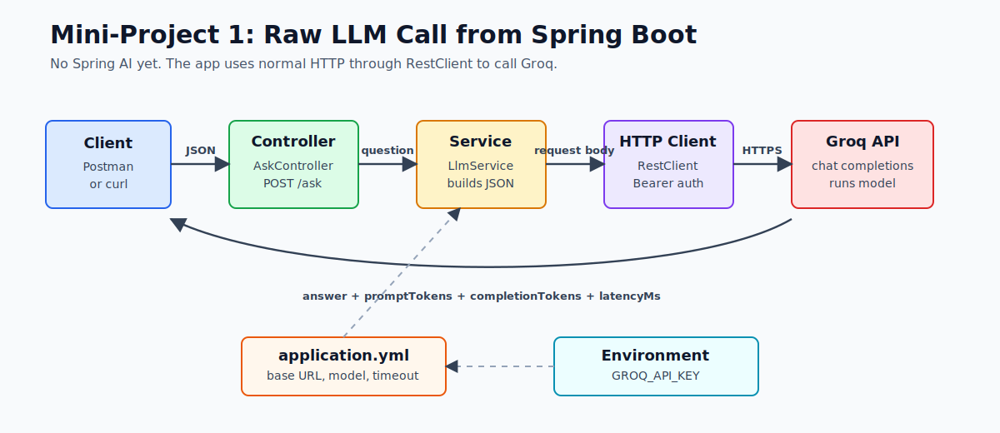
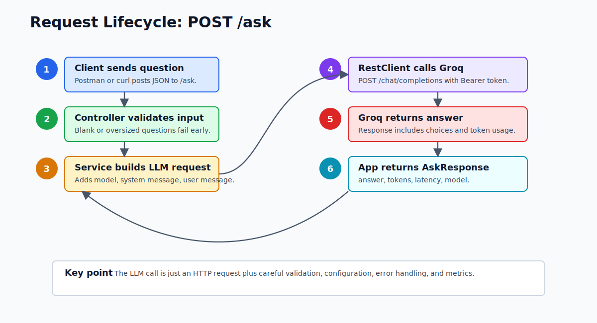
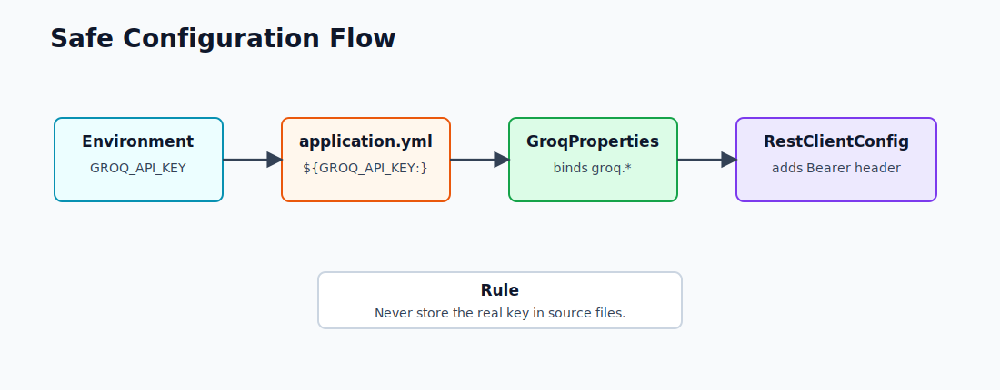

# Mini-Project Infographic Overview

This mini-project proves one core idea: a Spring Boot app can call an LLM using normal HTTP. No Spring AI is used yet. The goal is to understand the raw request, response, token usage, latency, and failure modes before using higher-level abstractions.

## One-Screen Architecture



## What Each Part Does

| Part | File | Responsibility |
|---|---|---|
| Controller | `AskController.java` | Accepts `POST /ask`, validates JSON, returns response |
| Request DTO | `AskRequest.java` | Requires a non-empty `question` up to 4000 characters |
| Service | `LlmService.java` | Builds request body, calls Groq, parses answer and usage |
| Config properties | `GroqProperties.java` | Binds `groq.*` values from `application.yml` |
| HTTP client config | `RestClientConfig.java` | Creates configured `RestClient` with base URL and API key |
| Error handler | `GlobalExceptionHandler.java` | Converts Java exceptions into HTTP error responses |

## Request Lifecycle



## Configuration Flow



Current safe configuration:

```yaml
groq:
  base-url: https://api.groq.com/openai/v1
  api-key: ${GROQ_API_KEY:}
  model: llama-3.3-70b-versatile
  timeout-seconds: 30
```

Do not paste the real API key into `application.yml`. It must stay in the environment variable.

## What You Should Learn

By understanding this mini-project, you should be able to explain:

1. What JSON your app sends to an LLM provider.
2. How a system message differs from a user message.
3. Where latency and token usage are measured.
4. Why API keys belong in environment variables.
5. How 401, 429, timeouts, and provider errors are handled.

## Simple Mental Model

```text
Spring Boot is not doing "AI" by itself.

Spring Boot:
  receives HTTP request
  validates input
  builds provider JSON
  sends HTTP request
  parses HTTP response
  handles errors

Groq:
  runs the model
  generates the answer
  returns usage metrics
```
