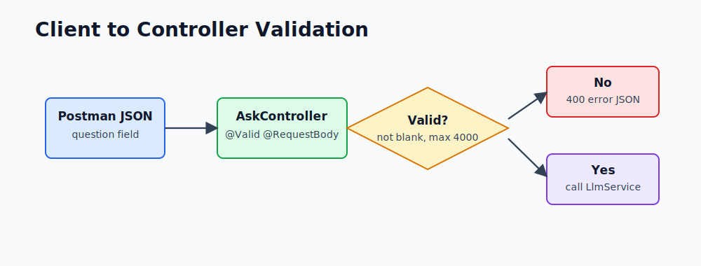
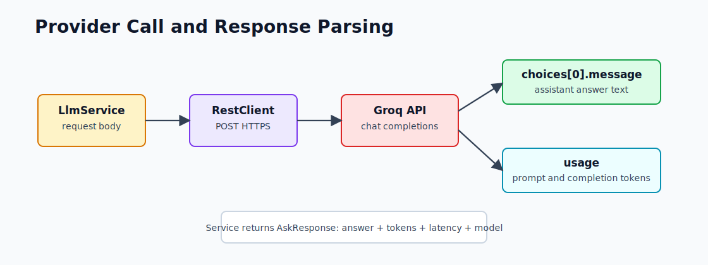

# Request and Response Walkthrough

This file explains the `/ask` API in detail, with examples you can run from Postman or `curl.exe`.

## Endpoint

```http
POST http://localhost:8080/ask
Content-Type: application/json
```

Request body:

```json
{
  "question": "Explain Spring Boot in 3 sentences"
}
```

Response body:

```json
{
  "answer": "Spring Boot is a framework...",
  "promptTokens": 52,
  "completionTokens": 74,
  "latencyMs": 1100,
  "model": "llama-3.3-70b-versatile"
}
```

The exact answer and token counts will change between calls because LLM output is probabilistic.

## Client to Controller



`AskRequest` enforces:

```java
@NotBlank(message = "question is required")
@Size(max = 4000, message = "question must be 4000 characters or less")
String question
```

Example invalid request:

```json
{
  "question": ""
}
```

Expected response:

```json
{
  "error": "question: question is required"
}
```

## Service Builds the Provider Request

Inside `LlmService`, the app creates an OpenAI-compatible request:

```json
{
  "model": "llama-3.3-70b-versatile",
  "temperature": 0.3,
  "max_tokens": 800,
  "messages": [
    {
      "role": "system",
      "content": "You are a helpful technical assistant..."
    },
    {
      "role": "user",
      "content": "Explain Spring Boot in 3 sentences"
    }
  ]
}
```

## Why `system` and `user` Are Separate

| Role | Meaning | Example |
|---|---|---|
| `system` | Long-running behavior instruction | "Be precise, practical, and direct." |
| `user` | Actual user task | "Explain Spring Boot in 3 sentences." |

This separation matters because your app can keep stable behavior in the system message while allowing user questions to change every request.

## Provider Call



The actual Java call:

```java
var response = restClient.post()
        .uri("/chat/completions")
        .body(requestBody)
        .retrieve()
        .body(GroqChatResponse.class);
```

## Response Parsing

The Groq response contains many fields. This app only needs two areas:

```json
{
  "choices": [
    {
      "message": {
        "content": "Spring Boot simplifies Spring application setup..."
      }
    }
  ],
  "usage": {
    "prompt_tokens": 52,
    "completion_tokens": 74
  }
}
```

The service extracts:

- `choices[0].message.content` as `answer`
- `usage.prompt_tokens` as `promptTokens`
- `usage.completion_tokens` as `completionTokens`
- elapsed time as `latencyMs`
- configured model as `model`

## Run Examples

Start the app:

```powershell
cd F:\GEN_AI_COURSE\module_01_foundations\mini_project
mvn spring-boot:run
```

Health check:

```powershell
curl.exe http://localhost:8080/actuator/health
```

Ask a simple question:

```powershell
curl.exe -X POST http://localhost:8080/ask `
  -H "Content-Type: application/json" `
  -d "{\"question\":\"Explain Spring Boot in 3 sentences\"}"
```

Ask for a Java example:

```powershell
curl.exe -X POST http://localhost:8080/ask `
  -H "Content-Type: application/json" `
  -d "{\"question\":\"Show a tiny Spring RestController example and explain it\"}"
```

## Postman Setup

1. Method: `POST`
2. URL: `http://localhost:8080/ask`
3. Headers: `Content-Type: application/json`
4. Body type: raw JSON

Body:

```json
{
  "question": "Explain RestClient in Spring Boot in 3 bullet points"
}
```

## How to Read the Result

Example:

```json
{
  "answer": "...",
  "promptTokens": 61,
  "completionTokens": 103,
  "latencyMs": 1420,
  "model": "llama-3.3-70b-versatile"
}
```

Interpretation:

| Field | Meaning |
|---|---|
| `answer` | Model-generated response |
| `promptTokens` | Tokens sent to the model |
| `completionTokens` | Tokens generated by the model |
| `latencyMs` | End-to-end provider call time measured by the service |
| `model` | Groq model used for the call |
