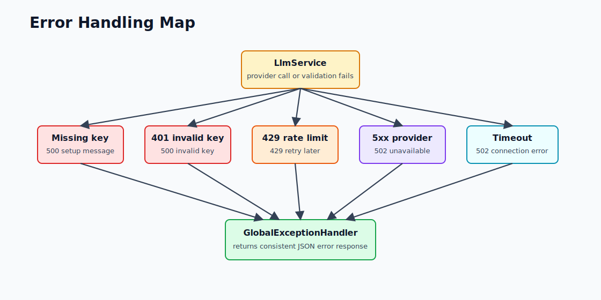
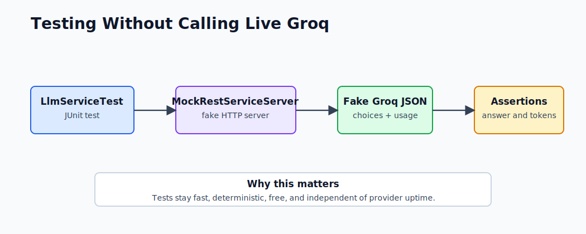

# Errors, Testing, and Troubleshooting

This mini-project is intentionally small, but it already handles common production-style LLM failures.

## Error Flow



## Error Mapping

| Situation | Where It Happens | HTTP Response |
|---|---|---|
| `GROQ_API_KEY` missing | Before provider call | `500` with setup message |
| Invalid API key | Groq returns `401` | `500` with invalid key message |
| Rate limit | Groq returns `429` | `429 Too Many Requests` |
| Provider outage | Groq returns `5xx` | `502 Bad Gateway` |
| Timeout/network issue | `ResourceAccessException` | `502 Bad Gateway` |
| Empty question | Validation failure | `400 Bad Request` |

## Common Issues

### Invalid API key

Symptom:

```json
{
  "error": "Invalid GROQ_API_KEY."
}
```

Fix:

```powershell
cd F:\GEN_AI_COURSE\module_01_foundations\mini_project
.\scripts\set-groq-key.ps1
.\scripts\test-groq-key.ps1
```

Restart the app after setting the key.

### Decommissioned model

Symptom:

```json
{
  "error": "LLM client error: 400 BAD_REQUEST"
}
```

Check [application.yml](../src/main/resources/application.yml). The model should be:

```yaml
model: llama-3.3-70b-versatile
```

### Port already in use

Symptom:

```text
Port 8080 was already in use
```

Fix:

```powershell
netstat -ano | findstr :8080
```

Then either stop that process or change:

```yaml
server:
  port: 8081
```

### Missing environment variable in app

PowerShell may show the key, but the app may still not see it if the terminal was opened before the variable was saved.

Fix:

1. Close the terminal running Spring Boot.
2. Open a new PowerShell.
3. Run `mvn spring-boot:run` again.

## Testing Strategy

The tests do not call the live Groq API. That is deliberate.



Why mock the provider?

- Tests are faster.
- Tests do not require internet.
- Tests do not spend tokens.
- Tests are deterministic.
- CI does not fail because a provider is down.

## Existing Test Cases

| Test | What It Proves |
|---|---|
| `contextLoads` | Spring Boot app starts with the configured beans |
| `returnsAnswerAndUsageWhenProviderResponds` | Service parses `choices` and `usage` correctly |
| `throwsHelpfulErrorWhenApiKeyMissing` | Missing API key fails before provider call |
| `mapsRateLimitResponseToDomainException` | HTTP 429 becomes `LlmRateLimitException` |

Run tests:

```powershell
cd F:\GEN_AI_COURSE\module_01_foundations\mini_project
mvn test
```

Expected result:

```text
Tests run: 4, Failures: 0, Errors: 0
BUILD SUCCESS
```

## What to Add Next

Useful next tests:

1. Mock `401` and assert `Invalid GROQ_API_KEY`.
2. Mock `500` and assert `LlmCallException`.
3. Mock malformed JSON and assert a safe error.
4. Add controller tests for empty `question`.
5. Add a test that verifies `model` is sent in the request body.

## Production Hardening Ideas

This is a learning project, not production yet. For production, add:

- Request IDs in logs.
- Token/cost metrics in Actuator.
- Retry policy for safe transient failures.
- Circuit breaker for repeated provider failures.
- Structured response validation.
- Provider abstraction for Groq, Ollama, Gemini, or OpenAI.
- Separate live integration test profile.

## Debug Checklist

When the app fails, check in this order:

1. Is Spring Boot running?
2. Does `/actuator/health` return `UP`?
3. Is `GROQ_API_KEY` valid?
4. Is the model active?
5. Is Postman sending `Content-Type: application/json`?
6. Is the request body valid JSON?
7. Does the app log show `401`, `429`, timeout, or `5xx`?
