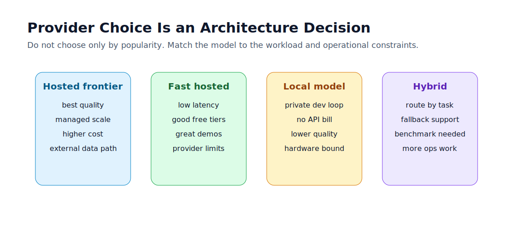

# 2.4 - Provider Comparison 2026

> Module 2 - File 4 of 8 - Choosing the right model provider for the job

## The Simple Idea

Provider choice is not just "which model is smartest?" It is an architecture decision involving quality, latency, cost, privacy, compliance, quotas, region, observability, and failure behavior.

The right design is often hybrid:

- local model for development and privacy-sensitive experiments
- fast hosted model for simple production tasks
- stronger hosted model for complex reasoning
- fallback provider for outages or quota limits

## Infographic



## Provider Categories

| Category | Examples | Best for | Watch out for |
|---|---|---|---|
| Frontier hosted | large hosted providers | quality, reasoning, broad capability | cost, data residency, quota |
| Fast hosted | Groq and smaller hosted models | low latency, demos, high throughput | model availability changes |
| Local | Ollama with small open models | private dev loop, offline demos, no API bill | weaker output, RAM/CPU limits |
| Cloud platform | Vertex AI, Azure OpenAI, Bedrock | enterprise controls, compliance, IAM | setup complexity |
| OpenAI-compatible routers | OpenRouter, some local servers | provider flexibility | extra dependency and policy layer |

Do not hardcode this table into your app. The market changes. Use it as a thinking framework.

## Decision Questions

Ask these before choosing:

1. Does data leave the machine or tenant boundary?
2. Is this user-facing latency or background processing?
3. Is the task simple extraction or complex reasoning?
4. Can the answer be cached?
5. What is the maximum acceptable cost per request?
6. What happens if the provider is down?
7. Does the model need tool calling, JSON output, image input, or long context?
8. Can a smaller model do the job if the prompt is better?

## Practical Recommendations for This Course

For your current setup:

| Use case | Suggested provider |
|---|---|
| Learning Spring AI API | Ollama `llama3.2:3b` first, then Groq |
| Fast hosted test | Groq with `llama-3.3-70b-versatile` |
| Local/offline practice | Ollama `llama3.2:3b` |
| Hosted experiment | Groq with `llama-3.3-70b-versatile` |
| Production-grade paid option | Start with Groq, then evaluate cloud providers based on compliance |

Because you have 8 GB RAM, do not expect local 8B or 70B models to feel smooth. Keep local learning on 3B-class models unless you have more memory.

## Cost and Latency Tradeoff

LLM cost usually comes from:

```text
input tokens + output tokens + model price + request volume
```

Latency usually comes from:

```text
network time + queue time + input tokens + generated tokens + provider speed
```

That means a cheaper model can still be expensive if your prompts are huge. A powerful model can still be slow if it generates long answers. Provider comparison must include real measurement, not only website claims.

## What to Benchmark

Your Module 2 mini-project `/compare` endpoint should capture:

| Metric | Why it matters |
|---|---|
| answer text | quality comparison |
| latencyMs | user experience |
| model | auditability |
| provider | routing analysis |
| promptTokens | input cost and context size |
| completionTokens | output cost |
| error | fallback behavior |

Benchmark the same prompt across providers. Use multiple prompt types: simple Q&A, code generation, summarization, strict JSON, and reasoning.

## Red Flags

- Choosing a provider only because it is popular.
- Using a 70B hosted model for every tiny classification.
- Sending private data to a hosted API without policy review.
- Depending on a free tier for production.
- Not logging which provider/model answered.
- Ignoring decommission notices for model names.

## Mini Exercise

Create a simple spreadsheet with these columns:

```text
provider, model, prompt type, latencyMs, promptTokens, completionTokens, subjective quality, notes
```

Run 5 prompts through Groq and Ollama. Do not debate providers in theory before measuring.

## Official Docs to Check

- Spring AI chat model provider list: `https://docs.spring.io/spring-ai/reference/api/chatmodel.html`
- Groq model list: `https://console.groq.com/docs/models`
