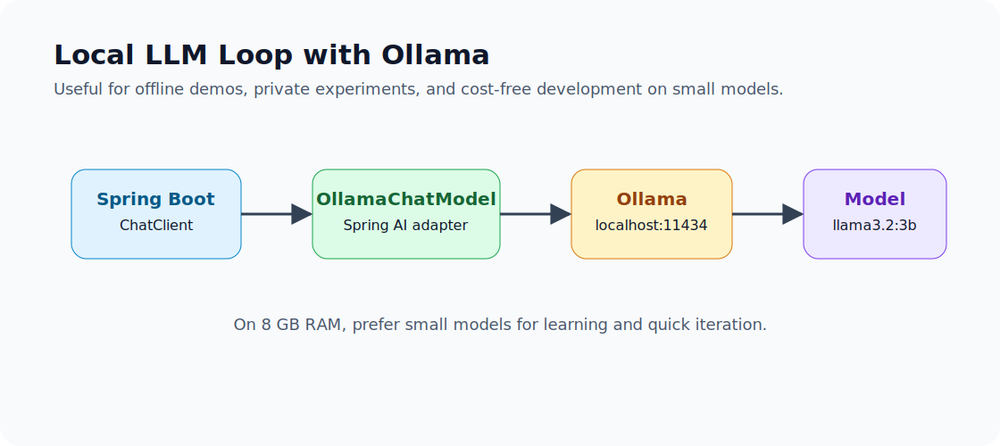

# 2.5 - Running Local LLMs with Ollama

> Module 2 - File 5 of 8 - Local models for learning, privacy, and fast iteration

## The Simple Idea

Ollama lets you run models on your own machine and expose them through a local HTTP service. Spring AI can call Ollama through `OllamaChatModel`, so your application still uses `ChatClient` while the model runs locally.

This is useful when:

- you are learning and do not want every test to hit a paid API
- you need an offline demo
- you want to avoid sending sample data to a hosted provider
- you want a predictable local development loop

## Infographic



## Your Local Setup

For this course machine, keep the local model small because RAM is 8 GB. You already pulled:

```text
llama3.2:3b
```

That is the right size for learning. Bigger local models can be slow or fail to load.

Start Ollama:

```powershell
F:\Ollama\ollama.exe serve
```

In another terminal, verify the model:

```powershell
F:\Ollama\ollama.exe run llama3.2:3b "Reply with exactly: local model works"
```

## Spring AI Dependency

Use the Ollama starter in the Module 2 mini-project:

```xml
<dependency>
  <groupId>org.springframework.ai</groupId>
  <artifactId>spring-ai-starter-model-ollama</artifactId>
</dependency>
```

## application-ollama.yml

```yaml
spring:
  ai:
    model:
      chat: ollama
    ollama:
      base-url: http://localhost:11434
      chat:
        options:
          model: llama3.2:3b
          temperature: 0.2
```

Then run:

```bash
mvn spring-boot:run -Dspring-boot.run.profiles=ollama
```

## What Changes in Code?

Ideally, nothing:

```java
String answer = chatClient.prompt()
        .user(question)
        .call()
        .content();
```

The provider changed from hosted Groq to local Ollama through configuration. The service stayed the same.

## Strengths of Local Models

| Strength | Why it matters |
|---|---|
| No per-call API bill | good for repeated practice |
| Works offline after model download | useful for demos and travel |
| Data stays on your machine | safer for sample private data |
| Fast feedback for prompt experiments | no hosted quota dependency |

## Limits of Local Models

| Limit | What it means |
|---|---|
| Lower quality on small models | complex reasoning may be weak |
| Hardware-bound | RAM and CPU/GPU decide speed |
| Model loading delay | first request can be slow |
| Different behavior from hosted models | prompts may need adjustment |

For production, local models can still make sense, but you need serious sizing, monitoring, and deployment planning. For this module, treat Ollama as a learning and comparison provider.

## Troubleshooting

| Symptom | Check |
|---|---|
| Connection refused | Is Ollama running on `localhost:11434`? |
| Model not found | Did you pull `llama3.2:3b`? |
| Very slow response | Is another model loaded or RAM pressured? |
| App starts with wrong provider | Is the `ollama` profile active? |
| Hosted provider still called | Check `spring.ai.model.chat` and active profiles |

## Mini Exercise

Ask the same prompt through Groq and Ollama:

```text
Explain Spring Boot auto-configuration to a Java developer in 5 bullets.
```

Compare:

- speed
- answer correctness
- detail level
- hallucination risk
- formatting consistency

This comparison is more valuable than arguing about model quality abstractly.

## Official Docs to Check

- Spring AI Ollama Chat: `https://docs.spring.io/spring-ai/reference/api/chat/ollama-chat.html`

