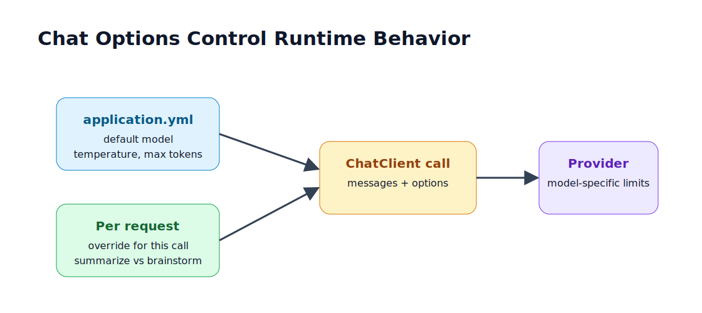

# 2.6 - ChatOptions: Temperature, Max Tokens, and Runtime Behavior

> Module 2 - File 6 of 8 - How to control model output without changing business code

## The Simple Idea

`ChatOptions` control how the model responds. The prompt says what you want. Options say how the model should generate.

Common options:

| Option | Meaning | Practical effect |
|---|---|---|
| model | which model to use | quality, speed, cost |
| temperature | randomness | lower is consistent, higher is creative |
| max tokens | output limit | controls answer length and cost |
| top-p | nucleus sampling | alternate randomness control |
| stop sequences | where generation stops | useful for strict formats |
| response format | JSON or structured mode when supported | improves parseability |

## Infographic



## Defaults in application.yml

Use config for stable defaults:

```yaml
spring:
  ai:
    openai:
      chat:
        options:
          model: llama-3.3-70b-versatile
          temperature: 0.3
          max-tokens: 800
```

These defaults should match the common path of the application. Do not force every call to pass the same options manually.

## Runtime Overrides

Use per-call options when one endpoint needs different behavior:

```java
String summary = chatClient.prompt()
        .user("Summarize this incident in 5 bullets: " + notes)
        .options(ChatOptions.builder()
                .temperature(0.1)
                .maxTokens(300)
                .build())
        .call()
        .content();
```

Use low temperature for extraction, classification, summaries, and code transformations. Use higher temperature for brainstorming, naming, creative writing, or alternative suggestions.

## Good Defaults by Task

| Task | Temperature | Max tokens | Notes |
|---|---:|---:|---|
| Classify support ticket | 0.0 - 0.2 | 50 - 150 | prefer deterministic |
| Summarize long text | 0.1 - 0.4 | 300 - 800 | keep concise |
| Generate Java code | 0.1 - 0.4 | 800 - 2000 | validate output |
| Brainstorm ideas | 0.7 - 1.0 | 500 - 1200 | allow variation |
| Strict JSON | 0.0 - 0.2 | enough for schema | combine with structured output |

Do not tune options randomly. Change one setting at a time and record the result.

## Model-Specific Options

Portable `ChatOptions` work across providers for common settings. Some providers expose extra options through model-specific option classes, such as OpenAI-specific options or Ollama-specific options.

Use portable options first:

```java
.options(ChatOptions.builder()
        .temperature(0.2)
        .maxTokens(500)
        .build())
```

Use provider-specific options only when you truly need a provider feature such as JSON mode, tool-choice control, seed, or special sampling behavior.

## Temperature Is Not Intelligence

Temperature does not make the model smarter. It changes sampling randomness.

Example:

```text
temperature 0.1:
Predictable, repeatable, safer for business tasks.

temperature 0.9:
More varied, sometimes useful, sometimes messy.
```

For backend systems, low temperature is usually the default. Creativity should be a feature choice, not an accident.

## Max Tokens Is a Guardrail

`maxTokens` limits generated output. It does not limit input length. If your request is too large, you still need to manage prompt size and retrieved context.

Bad use:

```text
Send a huge prompt and hope maxTokens saves cost.
```

Good use:

```text
Trim context first, then reserve enough output tokens for the answer.
```

## Mini Exercise

Run one prompt three times:

```text
Suggest 5 names for a Spring Boot AI support assistant.
```

Try:

```text
temperature 0.1
temperature 0.5
temperature 0.9
```

Notice where variety improves and where reliability drops.

## Official Docs to Check

- ChatClient defaults and runtime options: `https://docs.spring.io/spring-ai/reference/api/chatclient.html`
- Groq/OpenAI chat options: `https://docs.spring.io/spring-ai/reference/api/chat/groq-chat.html`

