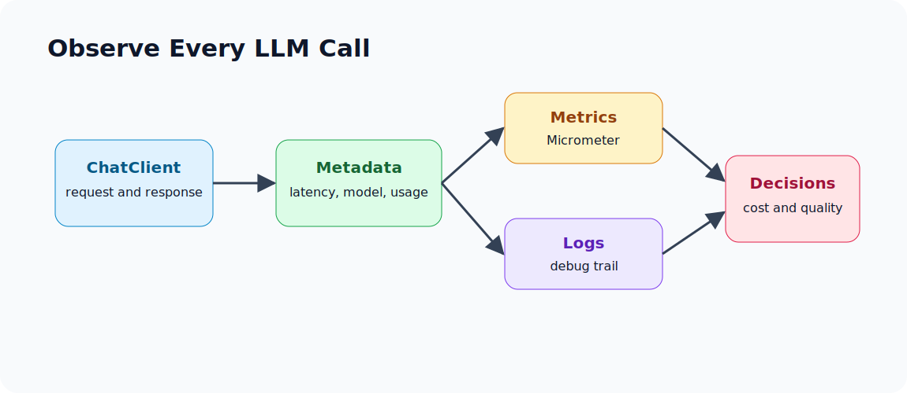

# 2.7 - Observability at the ChatClient Level

> Module 2 - File 7 of 8 - Make model calls measurable before they become expensive

## The Simple Idea

An LLM call is a remote dependency plus probabilistic output. You need to observe it like any other production dependency, but with extra AI-specific fields.

At minimum, capture:

- provider
- model
- latency
- prompt tokens
- completion tokens
- total tokens
- success or error
- endpoint/use case
- request id or trace id

## Infographic



## Why Normal HTTP Logs Are Not Enough

Module 1 logged raw latency and tokens manually. With Spring AI, the framework can expose model-level observations and integrate with the Spring observability stack. You should still design your own business-level logs.

Normal HTTP log:

```text
POST /ask 200 1420ms
```

Useful AI log:

```text
endpoint=/ask provider=groq model=llama-3.3-70b-versatile
latencyMs=1420 promptTokens=88 completionTokens=211 status=success
```

The second log explains cost and quality much better.

## Actuator Setup

Include Actuator:

```xml
<dependency>
  <groupId>org.springframework.boot</groupId>
  <artifactId>spring-boot-starter-actuator</artifactId>
</dependency>
```

Expose useful local endpoints:

```yaml
management:
  endpoints:
    web:
      exposure:
        include: health,info,metrics
```

Then inspect:

```bash
curl http://localhost:8080/actuator/health
curl http://localhost:8080/actuator/metrics
```

Metric names can change by Spring AI version and provider. Check the active `/actuator/metrics` list instead of guessing.

## What to Measure in `/compare`

The Module 2 mini-project should return a comparable shape:

```json
{
  "provider": "groq",
  "model": "llama-3.3-70b-versatile",
  "answer": "...",
  "latencyMs": 1234,
  "promptTokens": 71,
  "completionTokens": 180,
  "error": null
}
```

For Ollama, token metadata may be less consistent depending on provider support. Do not assume every provider returns identical metadata.

## Cost Debugging

If cost is high, ask:

1. Which endpoint uses the most tokens?
2. Are we sending too much conversation history?
3. Are retrieved chunks too large?
4. Are users asking for long answers by default?
5. Can a smaller or local model handle simple tasks?
6. Are we retrying expensive requests too aggressively?

## Latency Debugging

If latency is high, ask:

1. Is the provider slow or is our app slow?
2. Is the prompt huge?
3. Is output too long?
4. Is the model too large for the task?
5. Is Ollama loading the model cold?
6. Are calls happening serially when they could be parallel?

## Quality Debugging

If answers are bad, logs should help you reproduce:

- exact prompt template version
- model name
- temperature and max tokens
- retrieved context ids
- tool results used
- final answer

Do not log secrets, raw credentials, or sensitive user data. For real systems, redact or hash sensitive content and keep full payload capture behind strict controls.

## Mini Exercise

Add a log line around your future `/ask` service:

```java
log.info("llm_call endpoint=/ask provider={} model={} latencyMs={} status={}",
        provider, model, latencyMs, status);
```

Then decide which fields are safe to log in development only and which are safe in production.

## Official Docs to Check

- Spring AI observability: `https://docs.spring.io/spring-ai/reference/observability/index.html`
- Spring Boot Actuator: `https://docs.spring.io/spring-boot/reference/actuator/index.html`

