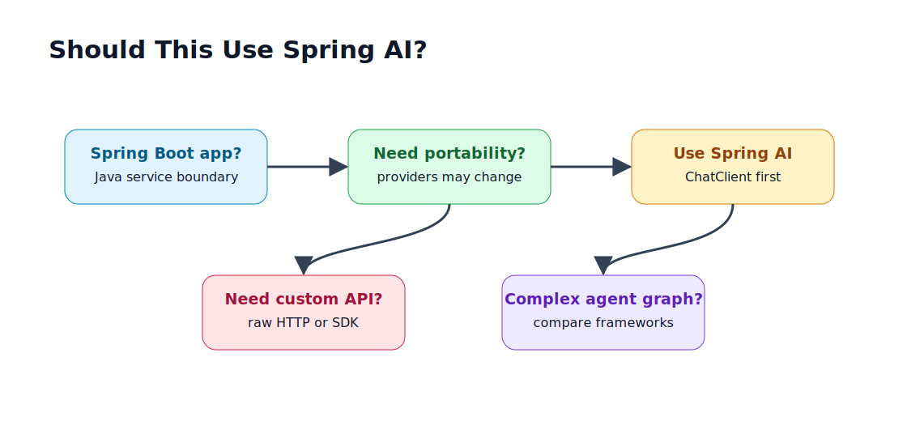

# 2.8 - When to Skip Spring AI

> Module 2 - File 8 of 8 - Use the abstraction when it helps, not by default religion

## The Simple Idea

Spring AI is a strong default for Spring Boot GenAI applications, but it is not always the best tool. A senior engineer should be able to explain when to use it and when to bypass it.

Use Spring AI when it reduces real complexity. Skip it when it hides details you must control.

## Infographic



## Good Fits for Spring AI

Use Spring AI when:

- the app is already Spring Boot
- you want provider portability
- the use case is chat, RAG, memory, tools, structured output, or embeddings
- the team knows Spring conventions
- you want Boot auto-configuration and Actuator integration
- you want to avoid provider-specific code in business services

This course uses Spring AI because your target skill is production GenAI with Java and Spring.

## Reasons to Use Raw HTTP

Raw HTTP can be better when:

- you need one tiny provider call and no abstraction
- the provider has a feature Spring AI does not expose yet
- you are debugging exact provider request/response behavior
- you need a custom retry, auth, or streaming protocol
- your integration must match provider docs byte-for-byte

Module 1 was raw HTTP deliberately. It taught you the shape Spring AI abstracts.

## Reasons to Use a Provider SDK

A provider SDK can be better when:

- you need the newest provider feature immediately
- the SDK supports an API area Spring AI does not cover
- vendor support requires official SDK usage
- your app is deeply tied to one provider

The tradeoff is lock-in. Provider SDKs are often excellent, but they make switching harder.

## Reasons to Compare LangChain4j or Other Frameworks

Another framework may be worth evaluating when:

- your application is primarily an agent orchestration system
- you need graph-based workflows as the core abstraction
- your team already uses that framework in production
- you need integrations not present in Spring AI

Do not choose a framework because it sounds more "AI native." Choose it because its abstraction matches the system.

## Decision Table

| Situation | Better default |
|---|---|
| Spring Boot service with `/ask` endpoint | Spring AI `ChatClient` |
| Provider portability is important | Spring AI |
| Need one unsupported provider feature today | raw HTTP or provider SDK |
| Need exact provider request debugging | raw HTTP |
| Complex multi-step Java workflow | Spring AI plus normal Spring services |
| Python-heavy research prototype | Python ecosystem may be faster |
| Production Java RAG service | Spring AI is a strong fit |

## Architecture Rule

Keep business logic separate from model-calling infrastructure.

Good:

```text
SupportTicketService
  -> TicketClassifier
  -> ChatClient
```

Bad:

```text
SupportTicketService
  -> OpenAI JSON body construction
  -> provider-specific parser
  -> business decision
```

Even if you skip Spring AI, create your own narrow boundary so provider code does not leak everywhere.

## Mini Exercise

For each feature below, decide whether you would use Spring AI, raw HTTP, or a provider SDK:

1. Simple `/ask` endpoint with Groq hosted mode and Ollama local mode.
2. One-off script that calls a single provider once per day.
3. Production RAG endpoint in Spring Boot.
4. A provider releases a new feature Spring AI does not support yet.
5. Local model demo using Ollama.

Expected answers:

1. Spring AI
2. raw HTTP is acceptable
3. Spring AI
4. raw HTTP or SDK until Spring AI catches up
5. Spring AI with Ollama starter

## Official Docs to Check

- Spring AI ChatClient API: `https://docs.spring.io/spring-ai/reference/api/chatclient.html`
- Spring AI upgrade notes: `https://docs.spring.io/spring-ai/reference/upgrade-notes.html`
