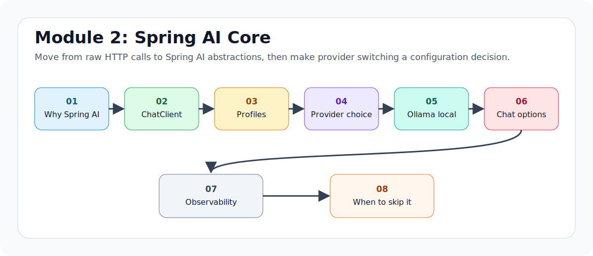

# Module 2 - Spring AI Core and Multi-Provider Setup

> Weeks 3-4 - ~16 hours

## What You Will Walk Away With



You will understand Spring AI's `ChatClient`, how it replaces the raw HTTP code from Module 1, and how to switch between providers using configuration instead of business-code changes.

By the end of this module, you should be comfortable with:

- `ChatClient.Builder`
- `prompt().user().call().content()`
- `ChatModel` vs `ChatClient`
- Spring profiles for Groq and Ollama
- provider selection tradeoffs
- local LLMs with Ollama
- temperature, max tokens, and runtime options
- basic observability for model calls

## Learning Hours Breakdown

| Activity | Hours |
|---|---:|
| Reading concept files | 6 |
| Running ChatClient examples | 3 |
| Provider profile setup | 2 |
| Ollama and hosted provider comparison | 2 |
| Mini-project | 2 |
| Interview prep and notes | 1 |
| Total | 16 |

## Files in This Module

Read in order:

1. `01_what_is_spring_ai_and_why_it_exists.md` - why Spring AI exists and what it abstracts
2. `02_chatclient_the_fluent_api.md` - `ChatClient` basics, prompts, templates, streaming, and responses
3. `03_application_yml_driven_multi_provider.md` - Spring profiles for Groq and Ollama
4. `04_provider_comparison_2026.md` - provider tradeoffs and what to benchmark
5. `05_running_local_llms_with_ollama.md` - local model setup using your existing `llama3.2:3b`
6. `06_chatoptions_temperature_max_tokens_etc.md` - runtime options and sensible defaults
7. `07_observability_at_the_chatclient_level.md` - latency, token usage, logging, and Actuator
8. `08_when_to_skip_spring_ai.md` - when raw HTTP or a provider SDK is better
9. `interview_prep.md` - short answers and scenario practice

## Mini-Project: Multi-Provider Chat Service

Rebuild Module 1's `/ask` endpoint using Spring AI's `ChatClient`.

Required providers:

- Groq using `llama-3.3-70b-versatile`
- Ollama using local `llama3.2:3b`

Required behavior:

- `POST /ask` returns one answer from the active profile
- `POST /compare` sends the same question to multiple configured providers
- each response includes provider, model, answer, latency, token data when available, and error if failed
- provider switching is done through Spring profiles, not controller if/else logic

## Recommended Commands

```bash
# Run with Groq profile
mvn spring-boot:run -Dspring-boot.run.profiles=groq

# Run with Ollama profile
mvn spring-boot:run -Dspring-boot.run.profiles=ollama

# Run tests
mvn test
```

For local Ollama on this machine:

```powershell
F:\Ollama\ollama.exe serve
F:\Ollama\ollama.exe run llama3.2:3b
```

## Interview Prep Highlights

By the end of Module 2, answer these cold:

1. What problem does Spring AI solve compared with raw HTTP?
2. What is the difference between `ChatClient` and `ChatModel`?
3. How does Spring Boot auto-configure a `ChatClient.Builder`?
4. How would you switch from Groq to Ollama without code changes?
5. When would you choose local Ollama over a hosted provider?
6. What do temperature and max tokens control?
7. What should you log for every LLM call?
8. When would you skip Spring AI?

## Official References

These docs were used while preparing this module. Check them again before implementing code because Spring AI moves quickly.

- Spring AI ChatClient API: `https://docs.spring.io/spring-ai/reference/api/chatclient.html`
- Spring AI Groq Chat: `https://docs.spring.io/spring-ai/reference/api/chat/groq-chat.html`
- Spring AI Ollama Chat: `https://docs.spring.io/spring-ai/reference/api/chat/ollama-chat.html`

Ready? Open `01_what_is_spring_ai_and_why_it_exists.md`.
