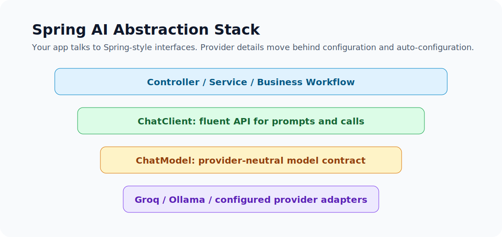
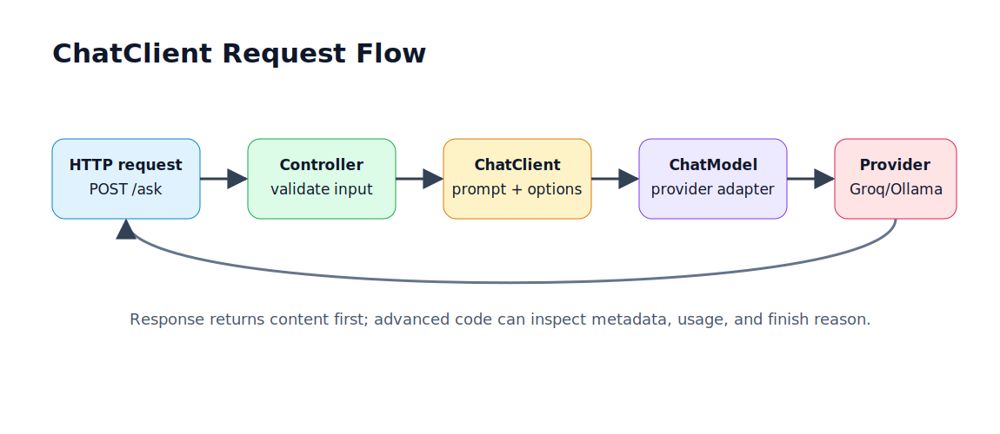
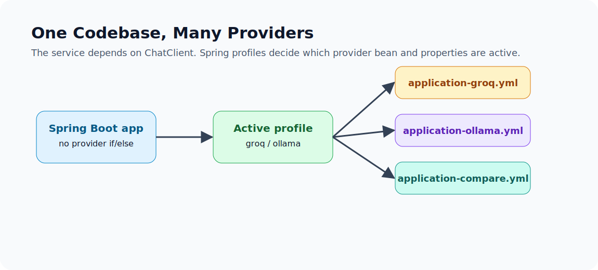

# Module 2 Interview Prep

Use these answers after reading files 01 through 08. Keep spoken answers short, then expand only if asked.

## 1. What Problem Does Spring AI Solve?

Spring AI gives Spring Boot applications a provider-neutral way to call LLMs. Instead of manually building HTTP requests, headers, provider JSON, and response parsers, application code can use `ChatClient` and externalized provider configuration.



Strong phrasing:

> "Spring AI does not replace engineering judgment. It moves provider details behind Spring abstractions so the service can focus on prompts, options, tools, retrieval, validation, and observability."

## 2. ChatClient vs ChatModel

`ChatClient` is the fluent application API. Use it for most service code.

`ChatModel` is the lower-level model contract. Use it when you need direct `Prompt` calls, custom model wiring, or multiple named model beans.

Short answer:

> "I start with `ChatClient`. I drop to `ChatModel` only when I need lower-level control."

## 3. Walk Through a ChatClient Call

A controller receives a request, validates it, passes the question to a service, and the service calls:

```java
chatClient.prompt()
        .user(question)
        .call()
        .content();
```

Spring AI builds the prompt, calls the configured `ChatModel`, receives the provider response, and returns content or a richer `ChatResponse`.



## 4. How Do You Switch Providers?

Keep the Java code stable and change the active Spring profile:

```bash
mvn spring-boot:run -Dspring-boot.run.profiles=ollama
```

The profile activates provider-specific config such as:

```yaml
spring:
  ai:
    model:
      chat: ollama
```



## 5. When Would You Use Ollama?

Use Ollama for local learning, offline demos, private sample-data experiments, and cost-free development loops. Avoid assuming a small local model will match hosted frontier quality.

For this machine, `llama3.2:3b` is the practical local model because RAM is 8 GB.

## 6. How Do You Choose a Provider?

Choose based on use case constraints: quality, latency, cost, privacy, compliance, quota, tool support, context size, and fallback needs.


Good answer:

> "I benchmark the same prompts across candidate providers and log model, latency, token usage, errors, and subjective quality."

## 7. What Do Temperature and Max Tokens Do?

Temperature controls randomness. Lower values are better for predictable business tasks. Higher values create more variety.

Max tokens limits generated output length. It helps control cost and response size, but it does not reduce input prompt size.


## 8. What Should You Observe?

For every important LLM call, track:

- provider
- model
- latency
- prompt tokens
- completion tokens
- endpoint/use case
- success or error
- trace id


## 9. When Would You Skip Spring AI?

Skip Spring AI when you need exact provider request control, a brand-new provider feature not exposed yet, a tiny one-off integration, or a provider SDK feature that matters more than portability.


## Fast Answers to Common Follow-Ups

| Question | Short Answer |
|---|---|
| Does Spring AI make the model safer? | No. You still need validation, authorization, and guardrails. |
| Can profiles switch providers? | Yes, for one active provider per run. |
| Can one app use multiple providers at once? | Yes, define multiple named `ChatClient` or `ChatModel` beans. |
| Should API keys be in YAML? | Use environment variables referenced from YAML, not literal keys. |
| Is local Ollama production-ready? | It can be, but only with proper sizing and operations. |
| Should temperature be high for all tasks? | No. Backend tasks usually use low temperature. |

## Scenario Questions

### "Compliance says data cannot leave the laptop during development."

Use the Ollama profile and a local model. Make sure logs do not send prompt content to external services. For production, evaluate data residency and hosting requirements separately.

### "Groq model name is decommissioned."

Do not change Java code. Update the provider profile model property, run a smoke test, and record the model change in release notes.

### "The app is too slow."

Measure provider latency, prompt size, output length, model choice, and local model loading time. Try a smaller model, shorter prompt, streaming, or parallel provider calls where safe.

### "The `/compare` endpoint has partial failures."

Return per-provider results with an `error` field instead of failing the whole comparison. This makes benchmarking and fallback behavior visible.

## One-Minute Summary

Spring AI lets a Spring Boot service talk to LLMs through familiar abstractions. `ChatClient` is the normal application API, profiles make provider switching clean, options control runtime behavior, and observability keeps cost and latency visible. Use it by default for Spring Boot GenAI apps, but skip it when exact provider control is more important than portability.

