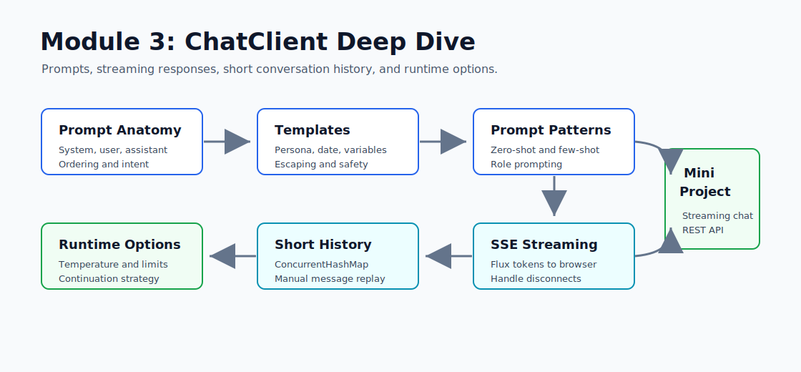

# Module 3 - ChatClient Deep Dive: Prompts, Streaming, Multi-Turn

> Week 5 - about 10 hours

## What You Will Walk Away With



You will move from "I can call an LLM" to "I can design a production-grade chat API." Module 2 proved that Spring AI can hide provider details. Module 3 goes deeper into how prompts are assembled, how streaming changes the user experience, and how to carry a short conversation history without introducing full memory yet.

By the end of this module, you should be comfortable with:

- message roles: system, user, assistant, and tool response
- `ChatClient` request construction
- prompt templates with runtime variables
- zero-shot, few-shot, and role prompting patterns
- Server-Sent Events for token streaming
- manual session history before Spring AI memory
- per-request temperature and max-token overrides
- long-output truncation and continuation strategies

## Learning Hours Breakdown

| Activity | Hours |
|---|---:|
| Reading concept files | 4 |
| Prompt template exercises | 1 |
| Streaming endpoint implementation | 2 |
| Manual session history | 1 |
| Testing and curl smoke checks | 1 |
| Interview prep and notes | 1 |
| Total | 10 |

## Files in This Module

Read in order:

1. `01_anatomy_of_a_prompt.md` - message roles, prompt ordering, and what the model sees
2. `02_prompt_templates_and_interpolation.md` - runtime variables, escaping, and safe templating
3. `03_prompt_engineering_techniques_in_spring_ai.md` - zero-shot, few-shot, role prompting, and reasoning prompts
4. `04_streaming_responses_with_sse.md` - `Flux<String>`, SSE events, and client disconnects
5. `05_multi_turn_conversations_no_memory_yet.md` - storing short history manually before Module 6 memory
6. `06_chatoptions_per_request.md` - temperature, max tokens, top-p, and provider-specific options
7. `07_handling_long_outputs_truncation.md` - detecting cutoffs and designing continuation flows
8. `interview_prep.md` - short answers and debugging scenarios

## Mini-Project: Streaming Chat REST API

Build a Spring Boot service that exposes both streaming and non-streaming chat endpoints.

Required behavior:

- `POST /api/chat/stream` returns `text/event-stream`
- `POST /api/chat/non-streaming` returns a normal JSON response
- optional `sessionId` keeps a short conversation history in memory
- system prompt uses runtime variables: `persona` and `currentDate`
- per-request `temperature` override is supported
- client disconnects are logged without corrupting session history
- default tests do not call live Groq or Ollama APIs

## Recommended Commands

```powershell
cd F:\GEN_AI_COURSE\module_03_chatclient_deep_dive\mini_project
mvn test
```

Run with local Ollama:

```powershell
F:\Ollama\ollama.exe serve

cd F:\GEN_AI_COURSE\module_03_chatclient_deep_dive\mini_project
mvn spring-boot:run -Dspring-boot.run.profiles=ollama
```

Smoke test streaming:

```powershell
curl.exe --no-buffer -X POST http://localhost:8081/api/chat/stream `
  -H "Content-Type: application/json" `
  -d "{\"sessionId\":\"m03-demo\",\"message\":\"Explain SSE for LLM streaming in 3 bullets\",\"temperature\":0.2}"
```

Smoke test non-streaming:

```powershell
curl.exe -X POST http://localhost:8081/api/chat/non-streaming `
  -H "Content-Type: application/json" `
  -d "{\"sessionId\":\"m03-demo\",\"message\":\"Now summarize that in one sentence\"}"
```

## Interview Prep Highlights

By the end of Module 3, answer these cold:

1. Why does a system message usually come before user messages?
2. What problem does a prompt template solve?
3. When is few-shot prompting worth the extra tokens?
4. Why is SSE a good default for LLM streaming?
5. What should happen when a browser disconnects mid-stream?
6. Why is manual history not the same as durable memory?
7. How do temperature and max tokens change response behavior?
8. How do you handle a response that stops because of token limits?

## Official References

Check these again before changing provider-specific code because Spring AI APIs move quickly.

- Spring AI ChatClient API: `https://docs.spring.io/spring-ai/reference/api/chatclient.html`
- Spring AI Prompts: `https://docs.spring.io/spring-ai/reference/api/prompt.html`
- Spring Framework WebFlux: `https://docs.spring.io/spring-framework/reference/web/webflux.html`
- Spring Framework SSE: `https://docs.spring.io/spring-framework/reference/web/webflux/controller/ann-methods/sse.html`

Ready? Open `01_anatomy_of_a_prompt.md`.
