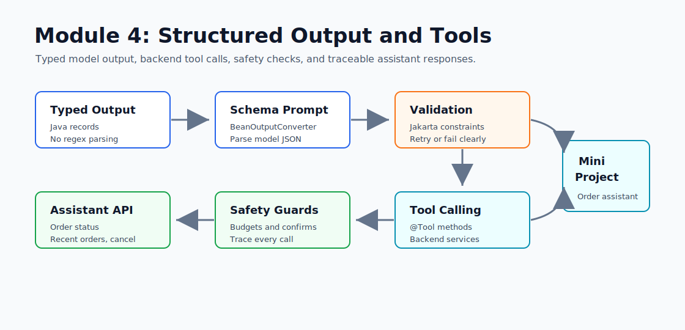

# Module 4 - Structured Output and Tool Calling

> Weeks 6-7 - about 14 hours

## What You Will Walk Away With



You will turn an LLM endpoint into a typed Spring Boot assistant that can call real backend services. Module 3 streamed text. Module 4 focuses on two production skills: making the model return Java records instead of loose strings, and letting the model call safe application tools.

By the end of this module, you should be comfortable with:

- `BeanOutputConverter` and typed Java records
- schema-first prompts for JSON responses
- validation and retry boundaries for model JSON
- `@Tool` and `@ToolParam`
- tool descriptions as part of prompt design
- tool safety checks for write operations
- limiting tool calls per request
- deciding between structured output, tool calling, and provider JSON mode

## Learning Hours Breakdown

| Activity | Hours |
|---|---:|
| Reading concept files | 5 |
| Structured output exercises | 2 |
| Tool annotation exercises | 2 |
| Mini-project implementation | 3 |
| Tests and failure scenarios | 1 |
| Interview prep and notes | 1 |
| Total | 14 |

## Files in This Module

Read in order:

1. `01_why_structured_output_matters.md` - typed records instead of fragile string parsing
2. `02_beanoutputconverter_deep_dive.md` - schema generation, prompt formatting, and parsing
3. `03_structured_output_for_classification_and_extraction.md` - enums, lists, nested records
4. `04_validation_with_jakarta_validation.md` - validation, retries, and failure handling
5. `05_introduction_to_tool_calling.md` - how model-selected function calls work
6. `06_the_tool_annotation_in_spring_ai.md` - `@Tool`, `@ToolParam`, and Spring beans
7. `07_designing_good_tools_descriptions_matter.md` - names and descriptions that models can choose
8. `08_multi_tool_assistants.md` - many tools, safe routing, and traceability
9. `09_tool_calling_vs_json_mode_vs_response_format.md` - when to use which technique
10. `10_pitfalls_loops_costs_hallucinated_args.md` - guardrails for real systems
11. `interview_prep.md` - short answers and debugging scenarios

## Mini-Project: Order Assistant with Backend Tools

Build a Spring Boot service that exposes an order assistant backed by real Java methods.

Required behavior:

- `POST /api/assistant` accepts a customer message
- `OrderService` owns an in-memory order store
- `OrderTools` exposes:
  - `getOrderStatus(orderId)`
  - `getRecentOrders(customerId)`
  - `cancelOrder(orderId, reason)`
- tool methods are annotated with `@Tool`
- the model can call tools through Spring AI `ChatClient`
- the final response is a typed `AssistantResponse`
- each response includes tool traces: tool name, arguments, and result summary
- a budget guard limits tool calls to 5 per request
- cancellation is rejected unless the request explicitly sets `confirmed: true`

## Recommended Commands

```powershell
cd F:\GEN_AI_COURSE\module_04_structured_output_tools\mini_project
mvn test
```

Run with Groq:

```powershell
$env:GROQ_API_KEY="your_key_here"

cd F:\GEN_AI_COURSE\module_04_structured_output_tools\mini_project
mvn spring-boot:run -Dspring-boot.run.profiles=groq
```

Smoke test:

```powershell
curl.exe -X POST http://localhost:8082/api/assistant `
  -H "Content-Type: application/json" `
  -d "{\"customerId\":\"cust-100\",\"message\":\"What is the status of order ORD-1001?\"}"
```

Try the safety path:

```powershell
curl.exe -X POST http://localhost:8082/api/assistant `
  -H "Content-Type: application/json" `
  -d "{\"customerId\":\"cust-100\",\"message\":\"Cancel order ORD-1002 because I changed my mind\",\"confirmed\":false}"
```

Then explicit confirmation:

```powershell
curl.exe -X POST http://localhost:8082/api/assistant `
  -H "Content-Type: application/json" `
  -d "{\"customerId\":\"cust-100\",\"message\":\"Cancel order ORD-1002 because I changed my mind\",\"confirmed\":true}"
```

## Interview Prep Highlights

By the end of Module 4, answer these cold:

1. Why is structured output better than regex parsing?
2. What does `BeanOutputConverter` add to the prompt?
3. What happens when the model returns invalid JSON?
4. How does Spring AI expose `@Tool` methods to the model?
5. Why are tool names and descriptions part of correctness?
6. How do you protect write tools such as `cancelOrder`?
7. Why limit tool calls per request?
8. When would you use JSON mode instead of tool calling?

## Official References

Check these again before changing provider-specific code because Spring AI APIs move quickly.

- Spring AI Structured Output: `https://docs.spring.io/spring-ai/reference/api/structured-output-converter.html`
- Spring AI Tools: `https://docs.spring.io/spring-ai/reference/api/tools.html`
- Spring AI ChatClient API: `https://docs.spring.io/spring-ai/reference/api/chatclient.html`

Ready? Open `01_why_structured_output_matters.md`.
