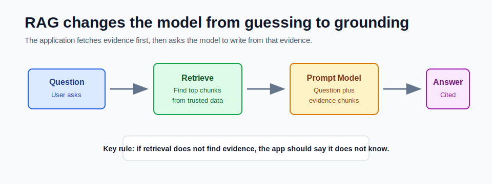

# What Is RAG and Why It Solves Hallucination



RAG means **Retrieval-Augmented Generation**.

In simple terms, RAG changes the application flow from:

```text
Ask the model -> hope the model knows -> return answer
```

to:

```text
Ask the application -> retrieve trusted context -> ask the model with that context -> return answer with citations
```

The model still writes the final answer. The difference is that the model is no longer expected to remember every fact from training. The application gives it relevant facts at request time.

## Why Hallucination Happens

Large language models generate likely text. They do not automatically know which facts are true in your private company documents, current database, or latest policy pages.

Hallucination usually appears when:

- the model was never trained on the fact
- the fact changed after training
- the prompt asks for private or internal knowledge
- the question is ambiguous
- the model receives no reliable source material
- the model tries to be helpful instead of saying "I do not know"

RAG reduces this problem by moving knowledge ownership from the model into your application and data store.

## What RAG Adds

RAG adds a retrieval step before generation.

| Without RAG | With RAG |
|---|---|
| Model answers from general training memory | App retrieves trusted chunks first |
| Hard to verify source | Response can include citations |
| Weak for private/current data | Stronger for private/current data |
| Prompt has only the user question | Prompt has question plus evidence |
| Model may invent missing details | App can refuse when evidence is missing |

The important point is that RAG is not only an AI pattern. It is an application architecture pattern.

## The Grounding Loop

A good RAG request has four steps:

1. The user asks a question.
2. The application searches a trusted knowledge store.
3. The application sends the question plus retrieved chunks to the model.
4. The application returns an answer plus citations.

The model is asked to answer only from the retrieved context. If the retrieved context is weak, the correct response is not a confident guess. The correct response is:

```text
I do not have enough information in the indexed documents.
```

## Example

Question:

```text
What is ChatClient used for?
```

Retrieved chunk:

```text
Spring AI ChatClient is the fluent API used by Java and Spring Boot applications to call chat models.
```

Grounded answer:

```text
ChatClient is used by Java and Spring Boot applications to call chat models through a fluent API.
Source: spring-ai-notes, chunk 0.
```

The answer is not coming from the model's memory alone. It is backed by the retrieved chunk.

## What RAG Does Not Solve

RAG reduces hallucination, but it does not eliminate it.

RAG can still fail when:

- the wrong chunks are retrieved
- the right chunk is not indexed
- chunks are too small and lose context
- chunks are too large and bury the answer
- the prompt does not clearly restrict the model
- citations are generated by the model instead of the application
- permissions allow the user to retrieve data they should not see

This is why production RAG needs evaluation, citations, access control, and observability.

## When to Use RAG

Use RAG when answers depend on:

- company documentation
- policies and procedures
- support knowledge bases
- product manuals
- customer-specific records
- frequently changing facts
- a document set too large for one prompt
- source material that must be cited

Do not use RAG for every AI feature. If the task is summarizing text the user already pasted into the request, retrieval may not be needed.

## How This Maps to the Mini-Project

In the Module 5 mini-project:

- `POST /api/documents/ingest` adds source material.
- `TextChunker` splits documents into smaller chunks.
- `EmbeddingGateway` turns chunks and questions into vectors.
- `VectorRepository` searches for similar chunks.
- `AnswerGateway` builds a grounded answer.
- `AnswerWithCitations` returns the answer plus sources.

The mini-project keeps retrieval explicit so you can see every step.

## Mental Model

Think of the model as the writer, not the database.

The database stores trusted knowledge. Retrieval selects the relevant evidence. The model turns that evidence into a useful answer. Citations let the user inspect the evidence.

## Checkpoint

Before moving on, make sure you can answer:

1. What does RAG retrieve before generation?
2. Why does RAG reduce hallucination?
3. Why can RAG still fail?
4. Why should citations come from retrieved chunks, not model imagination?
5. When would you skip RAG?
