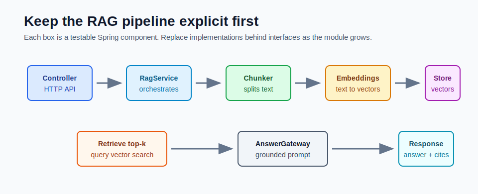

# The Spring AI RAG Pipeline



A RAG system has two jobs:

1. Prepare documents so they can be searched.
2. Use searched documents to ground model answers.

In Spring Boot, keep each job behind clear services. This makes the code easier to test, easier to debug, and easier to swap later.

## Pipeline Overview

A normal RAG pipeline has these steps:

1. Load documents.
2. Split documents into chunks.
3. Create embeddings for each chunk.
4. Store chunks and embeddings in a vector store.
5. Embed the user question.
6. Retrieve the most similar chunks.
7. Build a grounded prompt.
8. Call the chat model.
9. Return answer plus citations.

The Module 5 mini-project implements this shape directly.

```text
RagController
  -> RagService
    -> TextChunker
    -> EmbeddingGateway
    -> VectorRepository
    -> AnswerGateway
```

## Why Keep the Pipeline Explicit

Spring AI has higher-level helpers and advisors, but explicit services are better while learning because you can inspect every step.

| Component | Responsibility | Easy Test |
|---|---|---|
| `RagController` | HTTP request and response shape | validation and route tests |
| `RagService` | orchestration | ingest and ask flow |
| `TextChunker` | split source text safely | chunk count and boundaries |
| `EmbeddingGateway` | create vectors | deterministic vector shape |
| `VectorRepository` | store and search vectors | top-k ranking |
| `AnswerGateway` | generate final answer | grounded response behavior |

This separation also prevents a common mistake: putting retrieval, prompting, vector storage, and controller logic into one giant class.

## Ingestion Flow

Ingestion prepares the knowledge base.

```text
document content
  -> validate request
  -> split into chunks
  -> embed each chunk
  -> store chunk metadata + content + vector
```

The document is not sent to the model during ingestion. Ingestion is an indexing operation.

The result is a set of searchable rows:

```text
documentId
title
source
chunkIndex
content
embedding
```

## Question Answering Flow

Question answering uses the index.

```text
question
  -> embed question
  -> search vector repository
  -> get top-k chunks
  -> build prompt with chunks
  -> call model
  -> return answer with citations
```

The model should receive only the chunks that matter. Passing the whole document set into the prompt is slow, expensive, and usually impossible at scale.

## Where Spring AI Fits

Spring AI can help with:

- `ChatClient` for model calls
- model options such as temperature and max tokens
- provider switching between Ollama and OpenAI-compatible APIs
- advisors for later RAG abstraction
- vector store integrations in larger projects

This module still keeps the vector repository explicit so you understand the SQL and retrieval behavior.

## Why Tests Should Not Call Live LLMs

Default tests must be deterministic. A live model call can fail because of:

- network issues
- provider downtime
- quota limits
- key configuration
- model changes
- nondeterministic output

That is why the mini-project has:

- in-memory vector repository for default tests
- hash embeddings for deterministic local tests
- template answer gateway for offline behavior
- optional profiles for pgvector, Ollama, and Groq

## Common Design Mistakes

Avoid these early:

- hiding retrieval inside a prompt string
- storing vectors without source metadata
- generating citations in the LLM instead of the app response
- coupling the controller directly to pgvector SQL
- using live LLM APIs in default unit tests
- changing embedding models without rebuilding the index

## Mini-Project File Map

Use this map while reading the code:

```text
src/main/java/com/sani/ragdocs/controller/RagController.java
src/main/java/com/sani/ragdocs/service/RagService.java
src/main/java/com/sani/ragdocs/service/TextChunker.java
src/main/java/com/sani/ragdocs/embedding/EmbeddingGateway.java
src/main/java/com/sani/ragdocs/store/VectorRepository.java
src/main/java/com/sani/ragdocs/answer/AnswerGateway.java
```

## Checkpoint

You are ready for the next file when you can explain:

1. Which path runs during ingestion?
2. Which path runs during question answering?
3. Why does the controller not talk directly to pgvector?
4. Why do default tests use deterministic implementations?
5. Where does `ChatClient` belong in the pipeline?
