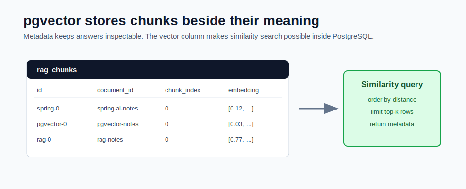

# pgvector Setup and Internals



pgvector is a PostgreSQL extension that adds a `vector` data type and vector similarity operators.

This means you can store normal relational metadata and embedding vectors in the same database.

## Why pgvector Is Useful

Many Java teams already run PostgreSQL. pgvector lets those teams add vector search without introducing a separate vector database on day one.

You still get:

- SQL
- transactions
- normal tables
- indexes
- backups
- migrations
- application-owned schema

And you also get vector similarity search.

## Basic Setup

The extension must be enabled in the database:

```sql
create extension if not exists vector;
```

The mini-project uses Docker:

```powershell
cd F:\GEN_AI_COURSE\module_05_rag_with_pgvector\mini_project
docker compose up -d
```

The Compose file starts a PostgreSQL image that already includes pgvector.

## Table Shape

A practical RAG table stores both metadata and vectors:

```sql
create table rag_chunks (
  id text primary key,
  document_id text not null,
  chunk_index int not null,
  title text not null,
  source text not null,
  content text not null,
  embedding vector(768) not null
);
```

Each row represents one chunk, not one full document.

## Why Store Metadata With the Vector

The answer response needs citations. Citations require metadata.

Store these fields with every chunk:

| Field | Why it matters |
|---|---|
| `document_id` | groups chunks back to the source document |
| `chunk_index` | points to the exact chunk |
| `title` | helps users understand the source |
| `source` | file path, URL, or system origin |
| `content` | the evidence text sent to the model |
| `embedding` | the vector used for similarity search |

If you store only vectors, you cannot explain where an answer came from.

## Vector Dimensions Must Match

The column dimension must match the embedding model output.

Examples:

```text
768-dimensional model -> embedding vector(768)
1536-dimensional model -> embedding vector(1536)
3072-dimensional model -> embedding vector(3072)
```

If the model returns 768 numbers and the table expects 1536, insertion fails.

Changing embedding models usually means:

1. choose new vector dimension
2. update schema
3. re-embed all chunks
4. rebuild vector indexes
5. retest retrieval

## Similarity Search

The mini-project uses cosine distance:

```sql
select id, document_id, title, source, content,
       1 - (embedding <=> '[0.1,0.2,...]'::vector) as relevance_score
from rag_chunks
order by embedding <=> '[0.1,0.2,...]'::vector
limit 5;
```

The operator returns distance. Lower distance means more similar.

Application responses often convert distance into a relevance score so the API is easier to read.

```text
distance low -> relevance high
distance high -> relevance low
```

## Indexes

Small datasets can run exact search without a vector index. Larger datasets need indexing.

Common pgvector index types:

| Index | Use |
|---|---|
| HNSW | strong default for many retrieval workloads |
| IVFFlat | useful when you tune lists and probes |

The mini-project attempts to create an HNSW index:

```sql
create index if not exists rag_chunks_embedding_hnsw_idx
on rag_chunks using hnsw (embedding vector_cosine_ops);
```

Even without the index, retrieval still works. It is just slower as data grows.

## Common pgvector Mistakes

- using the wrong vector dimension
- forgetting `create extension vector`
- storing chunks without `document_id`
- using one huge row per document
- changing embedding models without re-indexing
- treating similarity score as proof of correctness
- forgetting access-control filters in multi-tenant systems

## How This Maps to the Mini-Project

The pgvector implementation is in:

```text
mini_project/src/main/java/com/sani/ragdocs/store/PgVectorRepository.java
```

It creates the table, stores chunks, deletes documents, lists summaries, and searches by vector distance.

## Checkpoint

Make sure you can answer:

1. What is stored in one `rag_chunks` row?
2. Why does vector dimension matter?
3. What does cosine distance mean?
4. Why keep `source` and `chunk_index` in the table?
5. When does a vector index become important?
