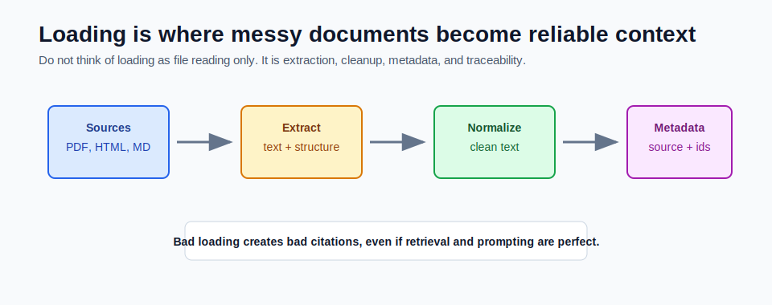

# Document Loading: PDFs, HTML, and Markdown



Document loading is the first quality gate in RAG.

If loading is poor, every later step suffers. Chunking, embeddings, vector search, and prompting cannot fully fix bad source extraction.

## What Document Loading Really Means

Loading is not just reading bytes from a file.

A good loader does four jobs:

1. Extracts text from the source.
2. Preserves useful structure.
3. Cleans noise.
4. Attaches metadata for citations.

For this module, start with text and Markdown because they are easy to inspect. Production systems often add more source types later.

## Common Source Types

| Source | What to watch for |
|---|---|
| Markdown | headings, code blocks, links, front matter |
| HTML | nav bars, footers, scripts, repeated layout text |
| PDF | page breaks, columns, headers, scanned pages |
| Database rows | permissions, freshness, row identity |
| Support tickets | thread order, customer privacy, attachments |
| Source code | file path, symbol names, package structure |

The goal is not to load every format immediately. The goal is to load the first format cleanly and preserve a path for more formats later.

## Metadata Is Not Optional

Every loaded document needs stable metadata.

At minimum:

```text
documentId
title
source
```

Every chunk later adds:

```text
chunkIndex
```

Together, those fields let the API return citations such as:

```json
{
  "documentId": "spring-ai-notes",
  "title": "Spring AI Notes",
  "source": "sample-docs/spring-ai-notes.md",
  "chunkIndex": 0
}
```

Without metadata, the user sees an answer but cannot verify it.

## Markdown Loading

Markdown is the best first format for learning because:

- it is plain text
- headings show structure
- code examples are readable
- diffs are easy to review
- the same file can be read by humans and machines

Good Markdown loading should preserve:

- headings
- ordered lists
- tables
- code blocks
- links when they are meaningful

For example, a heading can become useful context:

```text
## pgvector Setup

create extension if not exists vector;
```

If a retrieved chunk contains the heading, the model understands the section topic more easily.

## HTML Loading

HTML pages often contain repeated noise:

- navigation menus
- sidebars
- cookie banners
- footers
- script text
- hidden elements

Before indexing HTML, extract the main content. Do not embed the whole raw page.

Bad HTML chunk:

```text
Home Products Docs Pricing Login Cookie Settings Accept All...
```

Better HTML chunk:

```text
Spring AI ChatClient is a fluent API for calling chat models...
```

## PDF Loading

PDF is harder because it is a page layout format, not a clean text format.

PDF issues include:

- text extraction order can be wrong
- multi-column pages may mix lines
- headers and footers repeat on every page
- tables can become unreadable
- scanned PDFs need OCR

Start with simple PDFs only after text and Markdown work.

## Cleaning Rules

Useful cleaning:

- normalize line endings
- trim repeated whitespace
- remove empty boilerplate
- remove duplicate headers and footers
- preserve headings and code blocks

Dangerous cleaning:

- deleting all punctuation
- removing all line breaks
- stripping code indentation
- removing section titles
- mixing multiple documents into one text blob

RAG needs readable context, not just tokens.

## How This Maps to the Mini-Project

The mini-project endpoint accepts text directly:

```http
POST /api/documents/ingest
```

Request shape:

```json
{
  "documentId": "spring-ai-notes",
  "title": "Spring AI Notes",
  "source": "sample-docs/spring-ai-notes.md",
  "content": "Spring AI ChatClient is..."
}
```

This keeps the module focused on RAG mechanics. Later modules can add file upload, document readers, and scheduled indexing.

## Common Mistakes

- indexing documents without a stable `documentId`
- losing source paths during ingestion
- embedding raw HTML boilerplate
- treating PDFs as easy text files
- ignoring duplicate content
- mixing private and public data without permission checks

## Checkpoint

Before continuing, answer:

1. Why is Markdown a good first format?
2. Why is PDF extraction harder than Markdown?
3. Which metadata fields are required for citations?
4. What kind of HTML text should not be indexed?
5. Why is cleaning source text risky if done aggressively?
