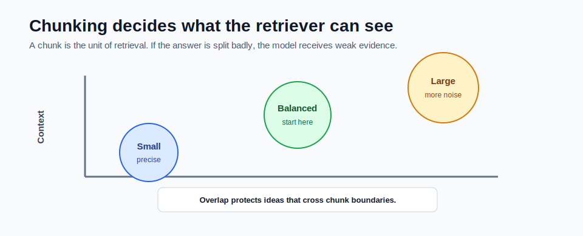

# Chunking Strategies



Chunking controls what the retriever can find.

A chunk is the unit of retrieval. The vector store does not usually return a whole document. It returns the chunks that are closest to the question.

## Why Chunking Matters

If chunks are too small, the answer may be split across multiple chunks.

If chunks are too large, the relevant sentence may be buried inside unrelated text.

The model can only answer well if the retrieved chunks contain enough signal.

## Small Chunks

Small chunks are precise.

Benefits:

- cheaper to embed
- cheaper to send to the model
- less unrelated text
- easier citations

Risks:

- missing surrounding context
- splitting definitions from examples
- splitting tables from headings
- forcing the retriever to find many related chunks

Example of too-small chunking:

```text
Chunk 1: ChatClient is the fluent API.
Chunk 2: It calls chat models.
Chunk 3: It supports provider options.
```

A question about what ChatClient does may need all three chunks.

## Large Chunks

Large chunks preserve context.

Benefits:

- fewer broken ideas
- more surrounding explanation
- better for long policies or procedures

Risks:

- more expensive prompts
- lower precision
- relevant text buried in noise
- citations become less exact

Example of too-large chunking:

```text
One chunk contains five pages of unrelated setup, model selection, environment variables, and RAG notes.
```

The vector may match the broad topic, but the answer sentence may be hard to locate.

## Overlap

Overlap repeats a small amount of text from one chunk into the next.

Example:

```text
chunk size: 900 characters
overlap: 120 characters
```

Overlap helps when an idea crosses the boundary between chunks.

Without overlap:

```text
Chunk A: RAG retrieves relevant context before
Chunk B: asking the model to answer.
```

With overlap, both chunks have enough context to stand alone.

## Good Starting Values

For beginner RAG projects:

| Setting | Starting Value |
|---|---:|
| chunk size | 700-1200 characters |
| overlap | 80-180 characters |
| top-k | 3-5 chunks |

These are not universal rules. They are starting points for experiments.

## Document-Aware Chunking

Simple character chunking is fine for learning. Production systems often need document-aware chunking.

Examples:

- Markdown: split by headings, then by length
- API docs: keep endpoint, request, and response together
- source code: split by class, method, or symbol
- legal docs: preserve clause hierarchy
- support tickets: preserve message order
- tables: avoid splitting header from rows

Document-aware chunking usually beats blind character splitting.

## How to Know Chunking Is Bad

Chunking may be weak when:

- top-k results are on-topic but not answer-bearing
- citations are too broad
- the model says "not enough information" even when the document exists
- answers require multiple chunks that are rarely retrieved together
- exact terms appear in documents but retrieval misses them

Use evaluation instead of guessing.

## How This Maps to the Mini-Project

The mini-project configuration starts with:

```yaml
app:
  rag:
    chunk-size: 900
    chunk-overlap: 120
```

The implementation lives in:

```text
mini_project/src/main/java/com/sani/ragdocs/service/TextChunker.java
```

Change `chunk-size` and `chunk-overlap`, re-ingest documents, and compare retrieval results.

## Common Mistakes

- setting overlap equal to chunk size
- changing chunking without re-ingesting
- assuming one chunk size works for every document type
- splitting code or tables blindly
- tuning prompts before checking retrieved chunks

## Checkpoint

Make sure you can answer:

1. What is the risk of chunks that are too small?
2. What is the risk of chunks that are too large?
3. Why does overlap help?
4. Why should chunking be retested after changing settings?
5. When would you use document-aware chunking?
