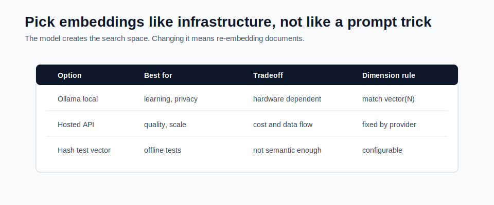

# Embedding Model Selection



An embedding model turns text into a vector.

Similar text should produce nearby vectors. Different text should produce distant vectors.

In RAG, embeddings decide what "similar" means for retrieval.

## What an Embedding Represents

An embedding is a list of numbers.

Example:

```text
"Spring AI ChatClient" -> [0.12, -0.04, 0.88, ...]
```

You do not read these numbers directly. The vector store compares them mathematically.

If the user asks:

```text
What API calls chat models in Spring AI?
```

the question embedding should be close to chunks about `ChatClient`.

## Local vs Hosted Embeddings

| Choice | Good For | Tradeoff |
|---|---|---|
| Ollama `nomic-embed-text` | local learning, privacy, no hosted key | slower on weak hardware |
| hosted embeddings | higher quality, scale, managed infra | cost and data leaves machine |
| open-source models | control and customization | more deployment work |
| deterministic hash embeddings | offline tests | not a real semantic model |

The Module 5 mini-project supports hash embeddings for tests and Ollama embeddings for local semantic retrieval.

## Dimension Rule

Every embedding model returns a fixed number of dimensions.

The database column must match:

```text
model returns 768 numbers -> embedding vector(768)
model returns 1536 numbers -> embedding vector(1536)
```

This is one of the most common pgvector errors.

If dimensions do not match, inserts fail.

## Changing Embedding Models

Changing the embedding model changes the meaning of every vector.

Do not mix vectors from different embedding models in the same search space unless you know exactly what you are doing.

When changing models:

1. choose the model
2. confirm dimensions
3. update configuration
4. update database schema if needed
5. delete or migrate old vectors
6. re-embed all chunks
7. rerun retrieval evaluation

## Quality Factors

Embedding quality depends on:

- language support
- domain vocabulary
- code understanding
- chunk length tolerance
- handling of abbreviations
- handling of exact identifiers
- speed and cost

For example, a general embedding model may understand "refund policy" but may struggle with exact internal ticket IDs or code symbols. That is where hybrid search helps later.

## Why Tests Use Hash Embeddings

The mini-project default profile uses deterministic hash embeddings because default tests should not require:

- Docker
- Ollama
- provider keys
- network access
- model downloads

Hash embeddings are not a production search solution. They are a test tool that keeps the architecture runnable.

## Configuration in the Mini-Project

Default:

```yaml
app:
  rag:
    embedding-provider: hash
    embedding-dimensions: 128
```

Ollama:

```yaml
app:
  rag:
    embedding-provider: ollama
    embedding-dimensions: 768
    ollama:
      embedding-model: nomic-embed-text
```

## Common Mistakes

- using an embedding dimension that does not match pgvector
- changing embedding model without re-indexing
- judging RAG quality from one happy-path demo
- using only vector search for exact IDs and codes
- calling hosted embedding APIs from default tests

## Checkpoint

Before moving on, explain:

1. What does an embedding model produce?
2. Why must dimensions match the table?
3. Why is changing embedding models a data migration?
4. Why are hash embeddings useful for tests?
5. When might vector search need keyword search help?
