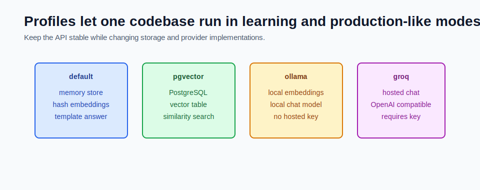

# pgvector in application.yml



Spring profiles let the same codebase run in different modes.

For RAG, profiles are useful because storage, embedding, and chat providers change between tests, local development, and production-like runs.

## Profile Strategy

This module uses these modes:

| Profile | Purpose |
|---|---|
| default | in-memory store, hash embeddings, template answer |
| `pgvector` | PostgreSQL/pgvector vector storage |
| `ollama` | local Ollama embeddings and chat |
| `groq` | hosted OpenAI-compatible chat through Groq |

The API stays the same. The implementations change behind Spring beans.

## Default Profile

The default profile should be boring and reliable.

It should run with:

```powershell
mvn test
mvn spring-boot:run
```

No Docker. No provider key. No model download.

That is why `application.yml` uses:

```yaml
app:
  rag:
    vector-store: memory
    embedding-provider: hash
    chat-provider: template
```

This is not meant to be production. It is meant to make the learning loop fast.

## pgvector Profile

The `pgvector` profile swaps the vector repository:

```yaml
spring:
  datasource:
    url: ${RAG_DB_URL:jdbc:postgresql://localhost:5433/ragdb}
    username: ${RAG_DB_USERNAME:rag}
    password: ${RAG_DB_PASSWORD:rag}

app:
  rag:
    vector-store: pgvector
```

Run it:

```powershell
cd F:\GEN_AI_COURSE\module_05_rag_with_pgvector\mini_project
docker compose up -d
mvn spring-boot:run "-Dspring-boot.run.profiles=pgvector"
```

On Windows PowerShell, quote the Maven profile flag.

## Ollama Profile

The `ollama` profile swaps embedding and chat providers:

```yaml
app:
  rag:
    embedding-provider: ollama
    chat-provider: spring-ai-ollama
    embedding-dimensions: 768
```

Run it with pgvector:

```powershell
F:\Ollama\ollama.exe serve
F:\Ollama\ollama.exe pull nomic-embed-text
F:\Ollama\ollama.exe pull llama3.2:3b

docker compose up -d
mvn spring-boot:run "-Dspring-boot.run.profiles=pgvector,ollama"
```

## Groq Profile

The `groq` profile uses hosted chat but can still use local or pgvector retrieval.

```yaml
app:
  rag:
    chat-provider: spring-ai-groq
```

Set the key in PowerShell:

```powershell
$env:GROQ_API_KEY="your_key_here"
mvn spring-boot:run "-Dspring-boot.run.profiles=pgvector,groq"
```

Do not commit real keys.

## Why Disable Unused Spring AI Modalities

Spring AI can auto-configure several model types. If you only need chat, unused modalities can still try to configure themselves.

This module disables unused model types in `application.yml`:

```yaml
spring:
  ai:
    model:
      audio:
        speech: none
        transcription: none
      chat: none
      embedding: none
      image: none
      moderation: none
```

That keeps default tests stable without provider credentials.

## Common Mistakes

- putting real API keys in `application.yml`
- running pgvector profile before Docker is up
- forgetting to quote `-Dspring-boot.run.profiles` in PowerShell
- changing embedding dimensions without updating pgvector schema
- expecting the default profile to behave like semantic production search

## Checkpoint

Confirm you can explain:

1. Why does the default profile avoid live providers?
2. What changes when `pgvector` is active?
3. What changes when `ollama` is active?
4. Where should secrets come from?
5. Why are provider flags quoted in PowerShell examples?
