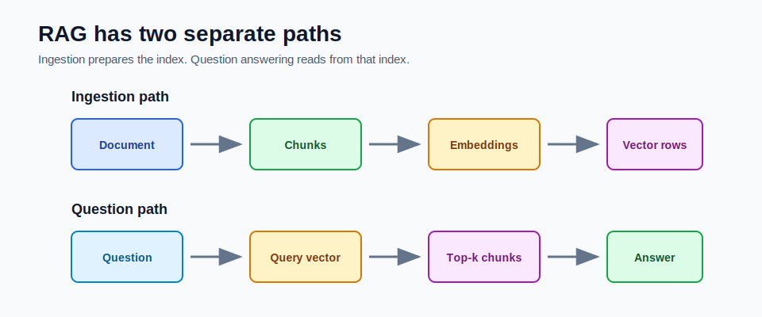

# Storing and Searching Documents



RAG has two separate paths:

1. Ingestion path: write searchable knowledge.
2. Question path: search that knowledge and answer from it.

Keeping these paths separate makes the system easier to reason about.

## Ingestion Path

Ingestion turns documents into vector rows.

```text
document -> chunks -> embeddings -> vector rows
```

Each chunk row should contain:

```text
id
documentId
chunkIndex
title
source
content
embedding
```

The `content` is what the model will eventually see. The `embedding` is what the vector store uses to search.

## Why Store Content and Embedding Together

The vector alone is not useful to the model. The model needs text.

The text alone is not enough for vector search. The vector store needs embeddings.

The metadata alone is not enough for an answer. The user needs citations and context.

A good chunk row keeps all three:

```text
metadata + content + embedding
```

## Re-Ingestion

When a document changes, delete old chunks for that `documentId` and insert new chunks.

Why delete first?

- old chunks may no longer exist
- chunk boundaries may change
- embeddings may change
- stale rows can be retrieved by mistake

The mini-project does this:

```text
delete existing chunks for documentId
save new chunks
```

## Question Path

Question answering does not scan raw text directly.

It does this:

```text
question -> question embedding -> vector similarity search -> top-k chunks
```

Then those chunks become the prompt context.

The app returns:

```text
answer + source citations
```

## Top-K

`topK` controls how many chunks are retrieved.

Low `topK`:

- cheaper
- less prompt noise
- may miss needed context

High `topK`:

- more context
- more expensive
- can confuse the model with weak chunks

Start with 3 to 5 chunks and evaluate.

## Similarity Is Not Truth

A high similarity score means the chunk is close to the query vector. It does not prove the chunk answers the question.

Example:

```text
Question: How do I cancel order ORD-1001?
High-score chunk: Order status APIs return current delivery state.
```

The chunk is related to orders, but it may not answer cancellation.

This is why you inspect retrieved chunks during debugging.

## How This Maps to the Mini-Project

Relevant files:

```text
VectorRepository.java
InMemoryVectorRepository.java
PgVectorRepository.java
RagService.java
```

Relevant endpoints:

```text
POST /api/documents/ingest
GET /api/documents
DELETE /api/documents
POST /api/rag/ask
```

## Debugging Retrieval

When an answer is blank, weak, or wrong, check:

1. Was the document ingested?
2. Did it create chunks?
3. Are the embeddings the expected dimension?
4. Does `/api/rag/ask` return sources?
5. Do the source chunks actually contain the answer?
6. Is `topK` too low?
7. Did you change chunking or embeddings without re-ingesting?

## Common Mistakes

- treating ingestion and question answering as one operation
- storing only vectors and losing source text
- not deleting old chunks on re-ingest
- using high `topK` to hide bad chunking
- trusting similarity score without reading the chunk

## Checkpoint

Make sure you can explain:

1. What happens during ingestion?
2. What happens during question answering?
3. Why does each chunk store metadata?
4. Why should document updates re-ingest chunks?
5. Why does top-k affect answer quality?
