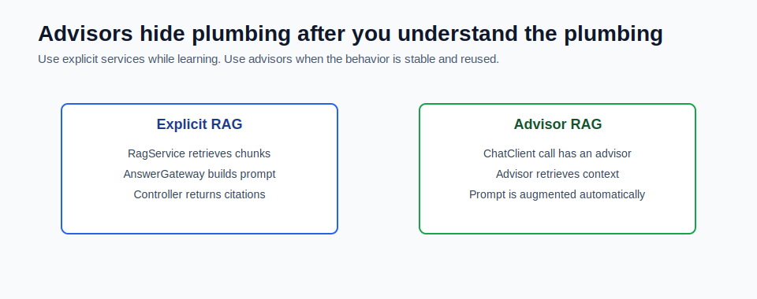

# QuestionAnswerAdvisor Native RAG



Spring AI has advisor patterns that can attach cross-cutting behavior to `ChatClient` calls.

RAG can be one of those behaviors. Instead of writing retrieval code around every call, an advisor can retrieve context and augment the prompt.

## What an Advisor Is

An advisor is like middleware for an AI call.

It can run before, around, or after the model request.

Advisors can help with:

- retrieval
- memory
- logging
- prompt enrichment
- safety checks
- observability
- common system instructions

In normal Spring terms, think of an advisor as a reusable concern around a `ChatClient` request.

## Explicit RAG vs Advisor RAG

In this module, retrieval is explicit:

```text
RagService retrieves chunks
AnswerGateway builds the grounded prompt
Controller returns citations
```

Advisor-based RAG looks more like:

```text
ChatClient prompt
  -> advisor retrieves context
  -> advisor augments prompt
  -> model answers
```

Both approaches can be valid.

## Why This Module Starts Explicit

Explicit retrieval is better while learning because:

- you can see exactly what was retrieved
- you can test vector search without a model
- you can return citations from application data
- you can debug wrong answers by inspecting chunks
- you understand the moving parts before hiding them

If you use an advisor too early, the system may feel magical. That is bad for debugging.

## When Advisors Become Useful

Advisors become useful when the pattern is stable and repeated.

Use an advisor when:

- many chat calls need the same retrieval behavior
- retrieval configuration is standardized
- citation handling is already designed
- observability is in place
- the team understands how retrieval works

Do not use an advisor to avoid learning the pipeline.

## Example Mental Model

Explicit version:

```java
var chunks = vectorRepository.search(questionEmbedding, topK);
var answer = answerGateway.answer(question, chunks);
return new AnswerWithCitations(question, answer, citations);
```

Advisor version:

```java
chatClient.prompt()
    .advisors(questionAnswerAdvisor)
    .user(question)
    .call()
    .content();
```

The advisor version is shorter, but the explicit version makes the retrieval contract obvious.

## Citation Concern

The biggest design question with advisor-based RAG is citations.

Ask:

- Where do source citations come from?
- Are citations returned as structured application data?
- Can the user inspect chunk text and scores?
- Can logs show which chunks were used?
- Can tests assert retrieved document IDs?

If citation handling becomes unclear, keep retrieval explicit.

## Debugging Concern

With explicit retrieval, you can log:

```text
question
query embedding dimension
top-k chunk IDs
source titles
relevance scores
answer text
```

With advisor retrieval, make sure the same information is still observable.

Production systems need traceability more than short code.

## How This Maps to Module 5

The Module 5 mini-project intentionally does not hide retrieval inside an advisor.

It uses:

```text
RagService
VectorRepository
AnswerGateway
AnswerWithCitations
```

This makes the RAG flow easy to explain in interviews and easy to modify in code.

## What to Learn Before Using Advisors

Before moving RAG into an advisor, be comfortable with:

- chunking
- embeddings
- vector dimensions
- top-k retrieval
- source metadata
- citation response shape
- retrieval evaluation
- access-control filters

After that, advisors are a cleanup step, not a shortcut.

## Common Mistakes

- using advisors before understanding retrieval
- losing structured citations
- making debugging harder
- hiding permission checks
- treating advisor output as automatically grounded
- assuming shorter code is better architecture

## Checkpoint

Make sure you can answer:

1. What behavior can an advisor add to `ChatClient`?
2. Why does Module 5 keep retrieval explicit?
3. When would advisor-based RAG be useful?
4. What citation risks appear when retrieval is hidden?
5. What logs would you want from a RAG advisor?
