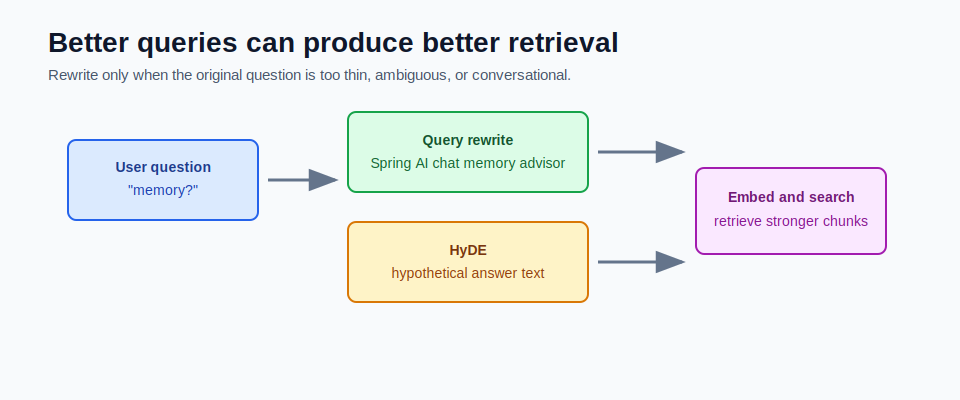

# Advanced Query Rewriting and HyDE



Sometimes the user question is too short, vague, or conversational for good retrieval.

Query rewriting improves the search query before embedding it.

## The Problem

Vector search compares the user question embedding with document chunk embeddings.

If the user asks:

```text
memory?
```

that query may be too vague. It could mean:

- Spring AI chat memory
- JVM memory
- database memory usage
- vector store memory
- conversation history

The retriever needs a better search representation.

## Query Rewriting

Query rewriting turns a weak question into a stronger search query.

Example:

```text
Original:
memory in spring ai

Rewritten:
Spring AI chat memory advisors conversation history storage retrieval
```

The rewritten query adds terms that are more likely to match useful chunks.

## When to Rewrite

Rewrite when:

- the question is very short
- the question uses pronouns like "that" or "it"
- the question depends on previous chat history
- the user uses informal wording
- retrieval often returns broad but weak chunks

Do not rewrite every query blindly. Good user questions may become worse if the rewrite adds assumptions.

## HyDE

HyDE means **Hypothetical Document Embeddings**.

The flow:

1. Ask a model to write a possible answer.
2. Embed that hypothetical answer.
3. Search using that embedding.
4. Retrieve real source chunks.
5. Answer from the real chunks.

The hypothetical answer is not trusted as truth. It is only used to create a richer retrieval vector.

## HyDE Example

Question:

```text
How does Spring AI remember conversation?
```

Hypothetical answer:

```text
Spring AI can use chat memory advisors to attach previous conversation messages to the prompt so the model has context.
```

That hypothetical answer may retrieve chunks about:

- advisors
- chat memory
- conversation history
- prompt context

## HyDE Risk

HyDE can also pull retrieval in the wrong direction.

If the hypothetical answer invents a concept, the embedding may retrieve chunks related to the invention instead of the actual source material.

That is why HyDE is an advanced tool, not the first thing to add.

## Safer Rewrite Prompt

A safer query rewrite prompt should avoid answering:

```text
Rewrite the user's question as a search query for a Spring AI documentation vector store.
Do not answer the question.
Do not add facts that are not implied.
Return only the rewritten search query.
```

The rewrite should improve retrieval, not become the final answer.

## Where Rewriting Fits

The normal question path is:

```text
question -> embed -> search -> answer
```

With rewriting:

```text
question -> rewrite -> embed rewritten query -> search -> answer original question
```

With HyDE:

```text
question -> hypothetical answer -> embed hypothetical answer -> search -> answer original question from real chunks
```

The final answer should still answer the original user question.

## How to Evaluate It

Add query rewriting only if metrics improve.

Compare:

- recall@k without rewrite
- recall@k with rewrite
- MRR without rewrite
- MRR with rewrite
- answer faithfulness
- latency
- cost

If recall improves but answers become less faithful, the rewrite is too aggressive.

## Common Mistakes

- treating HyDE output as trusted evidence
- using rewriting before fixing bad chunking
- rewriting precise queries into vague queries
- adding assumptions not present in the user request
- increasing latency without measuring quality

## How This Maps to Module 5

The mini-project does not implement rewriting yet. It gives you the baseline retrieval path first.

Add rewriting later only after you have baseline eval numbers from:

```text
POST /api/rag/eval
```

## Checkpoint

Make sure you can explain:

1. Why can short questions fail retrieval?
2. What does query rewriting change?
3. What does HyDE embed?
4. Why is HyDE output not evidence?
5. How would you decide whether rewriting helped?
