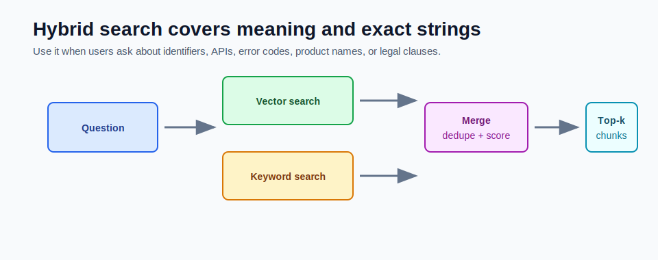

# Hybrid Search: Vector plus Keyword



Vector search finds semantic similarity.

Keyword search finds exact terms.

Hybrid search combines both.

## Why Vector Search Is Not Enough

Vector search is strong when the user says the same idea with different words.

Example:

```text
User: How do I send text to a model?
Chunk: ChatClient is the fluent API for calling chat models.
```

The terms are different, but the meaning is related.

Vector search is weaker for exact strings:

- order IDs
- error codes
- API names
- class names
- legal section numbers
- product SKUs
- ticket IDs

Example:

```text
ORD-1001
SQLSTATE 23505
ChatClient.Builder
Section 12.4
```

Exact identifiers should not depend only on semantic similarity.

## What Keyword Search Adds

Keyword search catches exact matches.

In PostgreSQL, that can mean:

- `to_tsvector` and `to_tsquery`
- `ILIKE` for simple demos
- trigram indexes for fuzzy text
- explicit filters for IDs and metadata

Keyword search is not a replacement for vector search. It is a second signal.

## Hybrid Flow

Hybrid search usually does this:

```text
question
  -> vector search top N
  -> keyword search top N
  -> merge candidates
  -> dedupe chunks
  -> combine scores
  -> return final top K
```

The merge step matters. You do not want duplicate chunks or one search mode to dominate every result.

## Score Combining

A simple hybrid score might look like:

```text
finalScore = 0.70 * vectorScore + 0.30 * keywordScore
```

But the best weights depend on your documents.

For API docs, keyword score may deserve more weight.

For conceptual support articles, vector score may deserve more weight.

## When to Add Hybrid Search

Add hybrid search when:

- users ask about exact identifiers
- retrieval misses class or method names
- error codes are important
- product names must match exactly
- legal clause numbers matter
- vector search returns related but not exact chunks

Do not add it just because it sounds advanced. Add it when eval or user testing shows vector-only search misses exact strings.

## Example

Question:

```text
What does error SQLSTATE 23505 mean?
```

Vector search may retrieve generic database error text.

Keyword search can find the exact chunk containing:

```text
SQLSTATE 23505 means unique_violation.
```

Hybrid search keeps both meaning and exact match coverage.

## How This Maps to Module 5

The mini-project starts with vector search only:

```text
question embedding -> pgvector similarity search -> top-k chunks
```

That is intentional. You need a clean baseline before adding hybrid complexity.

Later, `PgVectorRepository` could add:

- full-text index on `content`
- keyword search query
- merged candidate ranking
- exact metadata filters

## Common Mistakes

- using vector search for exact IDs only
- using keyword search for vague conceptual questions only
- merging scores without normalization
- forgetting to dedupe results
- making hybrid search slower without measuring quality

## Checkpoint

Before moving on, answer:

1. What does vector search do well?
2. What does keyword search do well?
3. Why do exact IDs often need keyword support?
4. What happens in the merge step?
5. When would you keep vector-only search?
