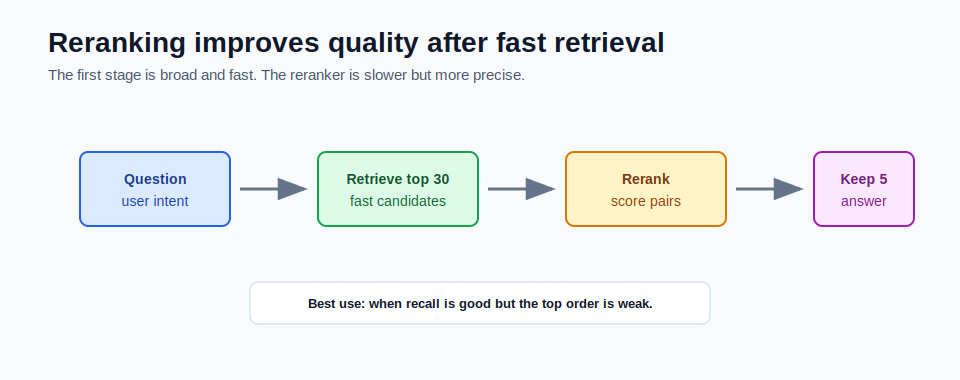

# Reranking for Quality



Reranking is a second retrieval stage.

The first retriever gets candidate chunks quickly. The reranker looks at those candidates more carefully and puts the best ones at the top.

## Why Reranking Exists

Vector search is fast, but it is approximate in two ways:

1. Embeddings compress meaning into numbers.
2. Vector indexes often optimize for speed.

The first stage may retrieve relevant chunks but put the best chunk at rank 8 instead of rank 1.

Reranking fixes ordering.

## Basic Flow

Without reranking:

```text
retrieve top 5 -> answer
```

With reranking:

```text
retrieve top 30 -> rerank -> keep best 5 -> answer
```

The first stage casts a wider net. The second stage chooses the strongest evidence.

## What a Reranker Scores

A reranker usually sees both the question and a candidate chunk.

It scores:

```text
How well does this chunk answer this question?
```

That is more precise than asking:

```text
Are these two vectors close?
```

## When Reranking Helps

Reranking helps when:

- the right chunk is retrieved but not high enough
- top results are related but not answer-bearing
- documents are long and similar
- multiple chunks share the same vocabulary
- users ask complex questions
- high precision matters more than low latency

It is often one of the biggest quality improvements after better chunking.

## When Reranking Is Not the First Fix

Do not add reranking first if:

- the right chunks are never retrieved
- source documents are missing
- chunking is broken
- embeddings are wrong dimension or wrong model
- filters are excluding the right documents

Reranking cannot rank a chunk it never receives.

## Cost and Latency

Reranking adds work.

If you retrieve 30 chunks, the reranker may compare the question with all 30.

This can add:

- latency
- compute cost
- provider dependency
- another model to evaluate

Use it where answer quality justifies the cost.

## Example

Question:

```text
How do citations prevent unsupported answers?
```

Initial vector search:

```text
1. General RAG overview
2. Citation response shape
3. Vector dimension notes
4. Grounding failure policy
5. pgvector SQL setup
```

Reranked:

```text
1. Citation response shape
2. Grounding failure policy
3. General RAG overview
```

The answer prompt now gets stronger evidence first.

## How This Maps to Module 5

The mini-project does not include reranking yet. It gives you a clean baseline:

```text
pgvector top-k -> answer
```

A later improvement could add:

```text
pgvector top-20 -> reranker -> top-5 -> answer
```

Measure before and after using `/api/rag/eval`.

## Common Mistakes

- reranking too few candidates
- reranking before fixing chunking
- trusting reranker scores without eval
- sending huge chunks to a reranker
- ignoring latency and cost

## Checkpoint

Make sure you can explain:

1. What does reranking improve?
2. Why retrieve more chunks before reranking?
3. Why can reranking not fix missing documents?
4. What quality metric should improve?
5. What cost does reranking add?
