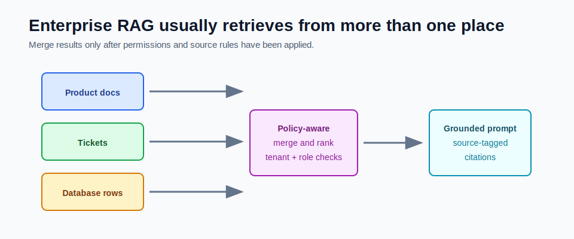

# Multi-Source Retrieval



Real RAG systems rarely use only one document folder.

They often retrieve from product docs, support tickets, database rows, policies, code, and user-specific records.

Multi-source retrieval is the design problem of searching those sources safely and merging results.

## Common Sources

| Source | Example Question |
|---|---|
| Product docs | How do I configure streaming? |
| Support tickets | Has this issue happened before? |
| Database rows | What is my order status? |
| Policy docs | Is this refund allowed? |
| Source code | Where is the API implemented? |
| Runbooks | What should I do during this incident? |

Each source has different update frequency, permissions, and citation needs.

## Why Source Metadata Matters

Every result should carry source information:

```text
sourceType
documentId
title
source
chunkIndex
relevanceScore
```

This lets the application:

- show citations
- apply source priority
- debug retrieval
- filter by permission
- explain why an answer used certain evidence

## Permission Rules

Multi-source retrieval must respect access control.

Do not retrieve first and filter later if retrieved private text can leak into logs, prompts, or traces.

Apply filters before or during retrieval:

```text
tenant_id = current tenant
user_role has access
document visibility allowed
source type enabled for this user
```

RAG does not remove normal backend security responsibilities.

## Merge Strategy

Different sources may return scores on different scales.

Example:

```text
product docs vector score: 0.82
ticket search score: 18.5
database exact match: true
```

You cannot merge these blindly.

A merge step may use:

- normalized scores
- source priority
- exact-match boosts
- freshness boosts
- permission filters
- deduplication

## Source Priority

Some sources should win over others.

Example:

```text
official policy document > old support ticket
current database row > cached summary
latest docs version > archived docs version
```

This priority is business logic, not model logic.

## Example

Question:

```text
Can customer C-100 cancel order ORD-1001?
```

Possible retrieval:

- database row: current order status
- policy doc: cancellation rules
- support ticket: similar cancellation issue

The answer may need all three, but the database row and policy doc should likely outrank the old ticket.

## How This Maps to Module 5

Module 5 uses one source: ingested document chunks.

That is the right starting point.

Later, the same interfaces can grow:

```text
VectorRepository for documents
OrderRepository for live orders
TicketRetriever for support history
PolicyRetriever for policy docs
```

The key is to keep each source explicit and permission-aware.

## Common Mistakes

- mixing public and private sources without filters
- treating every source score as comparable
- hiding source type from citations
- letting old tickets outrank official docs
- sending unauthorized chunks to the model
- using RAG where a direct database lookup is better

## Checkpoint

Make sure you can answer:

1. Why do different sources need different retrieval logic?
2. Why must permissions apply before prompting?
3. What metadata should every source return?
4. Why are scores hard to merge?
5. When is a direct database tool better than vector retrieval?
