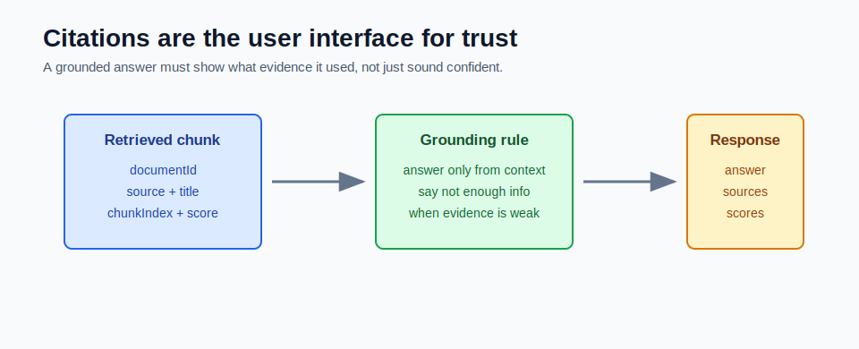

# Citations and Grounding



Citations make RAG inspectable.

Without citations, a RAG answer may sound convincing but still be hard to verify.

## What Grounding Means

Grounding means the answer is based on supplied evidence.

In RAG, the evidence is the retrieved chunks.

The model should not answer from general memory when the instruction says:

```text
Answer only from the retrieved context.
```

If the context does not contain the answer, the model should say that the indexed documents do not contain enough information.

## What a Citation Should Include

Each citation should be application-generated from retrieved chunks.

Useful fields:

```text
documentId
title
source
chunkIndex
relevanceScore
chunkText
```

The model can mention sources in prose, but the API response should still include structured source data.

## Why Structured Citations Matter

Structured citations allow the UI or caller to:

- show source cards
- open the original document
- highlight chunk text
- sort or filter sources
- debug weak answers
- audit what evidence was sent to the model

Prose-only citations are harder to trust.

## Good Response Shape

The mini-project returns:

```json
{
  "question": "What is ChatClient used for?",
  "answer": "ChatClient is used for calling chat models through a fluent API.",
  "sources": [
    {
      "documentId": "spring-ai-notes",
      "title": "Spring AI Notes",
      "source": "sample-docs/spring-ai-notes.md",
      "chunkIndex": 0,
      "chunkText": "Spring AI ChatClient is the fluent API...",
      "relevanceScore": 0.84
    }
  ]
}
```

The caller can inspect the source and decide whether the answer is supported.

## Failure Response

When retrieval is weak, the best answer is honest:

```text
I do not have enough information in the indexed documents.
```

This is better than:

```text
Based on general knowledge, I think...
```

RAG applications should reward refusal when evidence is missing.

## Grounding Prompt Pattern

A simple grounding instruction:

```text
You are a RAG assistant.
Answer only from the supplied context.
If the context is not enough, say you do not have enough information.
Do not invent facts or external references.
Mention the document ids you used.
```

This instruction helps, but it is not enough by itself. The application still needs structured citations.

## Citation Quality

A citation is useful only when:

- it points to the real source
- the cited chunk supports the answer
- the chunk is not too broad
- the source text is visible to the user
- the score is treated as a signal, not proof

If citations point to irrelevant chunks, users will lose trust quickly.

## App-Generated vs Model-Generated Citations

Prefer app-generated citations.

Reason:

- the app knows exactly which chunks were retrieved
- the app can include exact metadata
- the app can keep citation shape stable
- the model may invent source names if asked to cite freely

The model writes the answer. The application should attach the evidence record.

## Common Mistakes

- asking the model to invent citations
- returning an answer without sources
- hiding chunk text from the response
- citing the whole document when only one chunk was used
- treating high relevance score as final truth
- allowing unsupported fallback to general model knowledge

## How This Maps to Module 5

Relevant records:

```text
AnswerWithCitations
SourceCitation
RetrievedChunk
```

Relevant endpoint:

```text
POST /api/rag/ask
```

The controller returns both answer text and source data.

## Checkpoint

Make sure you can answer:

1. What does grounding mean?
2. Why should citations be structured?
3. Why should the app attach citations?
4. What should happen when context is weak?
5. How can citation quality be checked?
