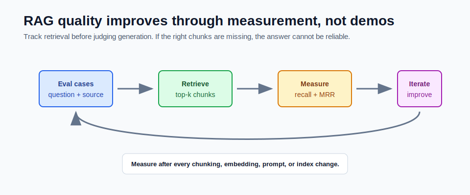

# Evaluating RAG



RAG quality should be measured.

A demo question proving one answer works is not evaluation. Evaluation means checking multiple questions against expected evidence and answer behavior.

## Start With Retrieval

Before judging the final answer, check retrieval.

If the right chunks are not retrieved, the model cannot reliably answer from them.

The first question is:

```text
Did retrieval find the source that contains the answer?
```

Only after retrieval works should you focus on answer wording.

## Useful Metrics

| Metric | Meaning |
|---|---|
| recall@k | Did the expected document or chunk appear in the top k results? |
| MRR | How high was the first correct result? |
| faithfulness | Does the answer stay inside the retrieved context? |
| relevance | Does the answer address the user question? |
| citation accuracy | Do the cited chunks support the answer? |
| latency | How long did retrieval and generation take? |

Start with recall@k because it is simple and tells you whether retrieval is basically working.

## recall@k

If the expected source appears in the top `k` retrieved chunks, the case passes.

Example:

```text
Question: What is ChatClient used for?
Expected document: spring-ai-notes
Top 3 retrieved documents: spring-ai-notes, rag-notes, pgvector-notes
Result: pass for recall@3
```

If the expected document is missing:

```text
Top 3 retrieved documents: pgvector-notes, rag-notes, chunking-notes
Result: fail for recall@3
```

## MRR

MRR means Mean Reciprocal Rank.

It rewards correct answers appearing higher in the result list.

If the first correct result is rank 1:

```text
reciprocal rank = 1 / 1 = 1.0
```

If the first correct result is rank 4:

```text
reciprocal rank = 1 / 4 = 0.25
```

Higher is better.

## Faithfulness

Faithfulness checks whether the final answer stays inside retrieved context.

Bad:

```text
The answer mentions a policy that was not in any retrieved chunk.
```

Good:

```text
The answer only uses facts from the cited chunks.
```

Faithfulness often needs human review, model-based evaluation, or strict answer constraints.

## Build a Small Eval Set

Start with 10 to 20 questions.

Each eval case should include:

```text
question
expectedDocumentId
expectedChunkHint
notes
```

Example:

```text
question: What stores embeddings in PostgreSQL?
expectedDocumentId: pgvector-notes
expectedChunkHint: pgvector stores embeddings in vector columns
```

Small eval sets catch regressions quickly.

## What to Change When Eval Fails

If recall is low:

- improve chunking
- add overlap
- improve document loading
- change embedding model
- add hybrid search
- add filters or metadata

If recall is good but answer quality is weak:

- improve grounded prompt
- reduce noisy top-k chunks
- add reranking
- improve citation formatting
- make refusal behavior stricter

Do not tune prompts when retrieval is the real failure.

## How This Maps to Module 5

The mini-project includes:

```text
POST /api/rag/eval
```

It runs a small retrieval eval set and returns:

```json
{
  "totalCases": 3,
  "passed": 3,
  "recallAtK": 1.0,
  "results": []
}
```

This is not a full benchmark. It teaches the habit of measuring retrieval.

## Run the Eval Endpoint

Start the app:

```powershell
cd F:\GEN_AI_COURSE\module_05_rag_with_pgvector\mini_project
mvn spring-boot:run
```

Ingest sample-like content, then call:

```powershell
curl.exe -X POST http://localhost:8083/api/rag/eval
```

The eval endpoint is most useful after you ingest documents whose IDs match the fixed eval cases.

## Common Mistakes

- testing only one happy-path question
- judging answers without inspecting retrieved chunks
- changing chunking without rerunning eval
- trusting high similarity scores blindly
- using live paid providers in default tests
- measuring only answer style, not source correctness

## Checkpoint

Make sure you can answer:

1. Why evaluate retrieval before generation?
2. What does recall@k measure?
3. What does MRR reward?
4. What does faithfulness check?
5. What would you change if recall is low?
