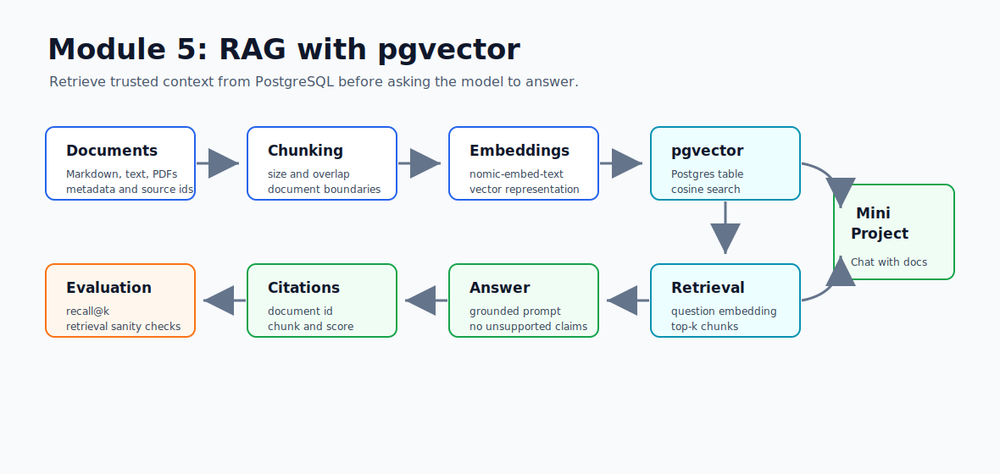

# Module 5 - RAG with pgvector

> Weeks 8-9 - about 18 hours

## What You Will Walk Away With



You will build the most common production GenAI pattern: Retrieval-Augmented Generation. Instead of asking a model to guess from memory, you will retrieve relevant document chunks from PostgreSQL/pgvector and pass those chunks into the prompt with citations.

By the end of this module, you should be comfortable with:

- RAG architecture: ingest, chunk, embed, store, retrieve, answer
- pgvector storage and cosine similarity
- metadata and citation design
- chunk-size and overlap tradeoffs
- local embeddings through Ollama or deterministic test embeddings
- grounded answer generation
- basic retrieval evaluation
- when to add hybrid search and reranking

## Learning Hours Breakdown

| Activity | Hours |
|---|---:|
| Reading concept files | 6 |
| PostgreSQL/pgvector setup | 2 |
| Ingestion pipeline | 3 |
| Retrieval and answer generation | 3 |
| Evaluation endpoint | 2 |
| Tests and notes | 2 |
| Total | 18 |

## Files in This Module

Read in order:

1. `01_what_is_rag_and_why_it_solves_hallucination.md` - why retrieval grounds model answers
2. `02_the_spring_ai_rag_pipeline.md` - reader, splitter, embeddings, vector store, chat client
3. `03_pgvector_setup_and_internals.md` - extension, vector columns, distance, indexes
4. `04_document_loading_pdfs_html_markdown.md` - Markdown, PDFs, metadata, source ids
5. `05_chunking_strategies.md` - chunk size, overlap, document-aware chunking
6. `06_embedding_model_selection.md` - local and hosted embedding choices
7. `07_pgvector_in_spring_ai_application_yml.md` - profile-based pgvector configuration
8. `08_storing_and_searching_documents.md` - add chunks and similarity search
9. `09_questionansweradvisor_native_rag.md` - when to use Spring AI advisors
10. `10_advanced_query_rewriting_hyde.md` - query rewriting and HyDE
11. `11_hybrid_search_vector_plus_keyword.md` - vector plus keyword search
12. `12_reranking_for_quality.md` - second-stage ranking
13. `13_multi_source_retrieval.md` - multiple stores and result fusion
14. `14_citations_and_grounding.md` - source-aware answers
15. `15_evaluating_rag.md` - recall, MRR, faithfulness, eval sets
16. `interview_prep.md` - design and debugging questions

## Mini-Project: Chat with Docs using Spring AI and pgvector

Build a Spring Boot service that can ingest text/Markdown documents, chunk them, embed each chunk, store vectors in pgvector, retrieve relevant chunks, and answer with citations.

Required behavior:

- `POST /api/documents/ingest` stores a document as chunks
- `GET /api/documents` lists ingested documents
- `DELETE /api/documents` clears chunks
- `POST /api/rag/ask` returns `AnswerWithCitations`
- `POST /api/rag/eval` runs a small retrieval eval set
- default tests do not need Docker or a live LLM
- `pgvector` profile uses PostgreSQL + pgvector
- `ollama` profile can use local `nomic-embed-text` and `llama3.2:3b`

## Recommended Commands

Run tests:

```powershell
cd F:\GEN_AI_COURSE\module_05_rag_with_pgvector\mini_project
mvn test
```

Start pgvector:

```powershell
docker compose up -d
```

Run with pgvector and deterministic local hash embeddings:

```powershell
mvn spring-boot:run "-Dspring-boot.run.profiles=pgvector"
```

Run with pgvector plus Ollama embeddings/chat:

```powershell
F:\Ollama\ollama.exe serve
F:\Ollama\ollama.exe pull nomic-embed-text
F:\Ollama\ollama.exe pull llama3.2:3b

mvn spring-boot:run "-Dspring-boot.run.profiles=pgvector,ollama"
```

Smoke test:

```powershell
curl.exe -X POST http://localhost:8083/api/documents/ingest `
  -H "Content-Type: application/json" `
  -d "{\"documentId\":\"spring-ai-notes\",\"title\":\"Spring AI Notes\",\"source\":\"manual\",\"content\":\"Spring AI ChatClient is the fluent API for calling chat models. RAG retrieves relevant context before asking the model to answer.\"}"
```

```powershell
curl.exe -X POST http://localhost:8083/api/rag/ask `
  -H "Content-Type: application/json" `
  -d "{\"question\":\"What is ChatClient used for?\",\"topK\":3}"
```

## Interview Prep Highlights

By the end of Module 5, answer these cold:

1. Why does RAG reduce hallucination but not eliminate it?
2. How do chunk size and overlap change retrieval quality?
3. Why pgvector instead of a managed vector database?
4. How do you return citations?
5. What is recall@k?
6. When does keyword search beat vector search?
7. What does reranking improve?
8. How would you design RAG for 10 million enterprise documents?

## Official References

- Spring AI RAG and Advisors: `https://docs.spring.io/spring-ai/reference/api/retrieval-augmented-generation.html`
- Spring AI Vector Stores: `https://docs.spring.io/spring-ai/reference/api/vectordbs.html`
- pgvector: `https://github.com/pgvector/pgvector`

Ready? Open `01_what_is_rag_and_why_it_solves_hallucination.md`.
